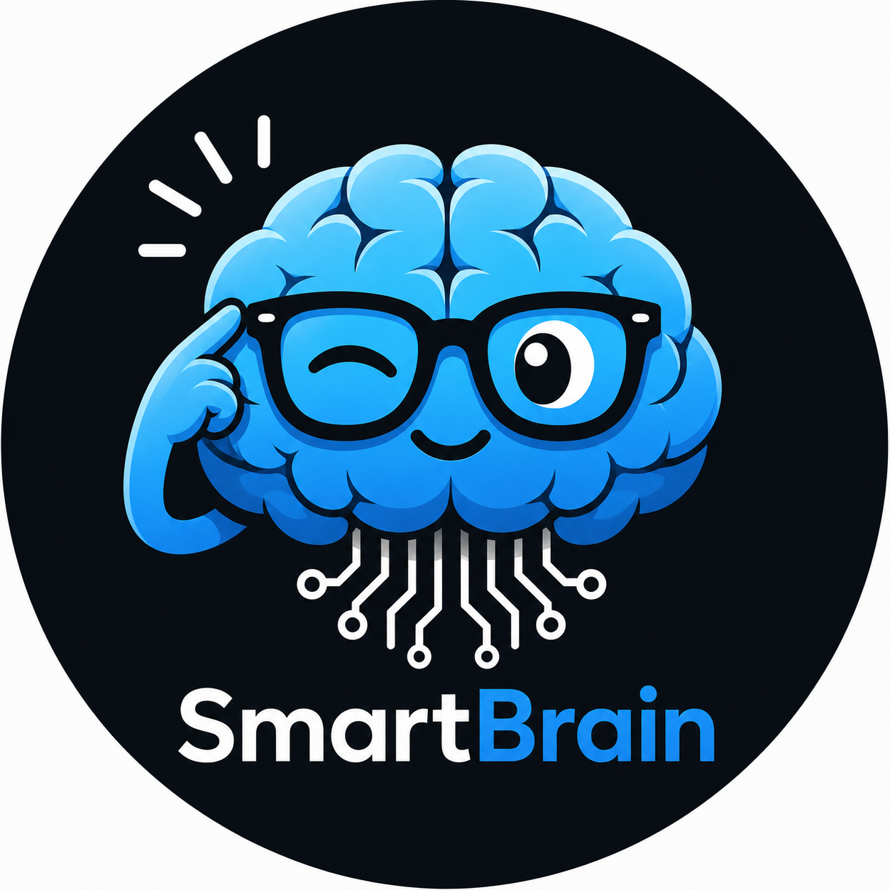

<p align="center">
  
</p>

# SmartBrain_3000

A personal AI assistant that runs **entirely on your own machine** — your
knowledge, your AI models, and your credentials stay on your hardware, encrypted
at rest under a passphrase only you hold. Nothing is sent to us, ever.

<p align="center">
  
  <br/><em>From one command to your unlocked Chat.</em>
</p>

## What it is

SmartBrain_3000 is a **fully local, single-user** AI assistant you run in Docker
on your own computer — macOS, Linux, or Windows.

- **Your choice of AI.** Bring your own API keys for OpenAI, Anthropic, or
  Google — or run **fully local models** with Ollama or Apple MLX. A built-in
  gateway routes between them.
- **Your data, encrypted on-device.** Your knowledge base, notes, plans, and
  secrets live in a local database, encrypted at rest under a passphrase only
  you hold.
- **Chat with tools, under your control.** The assistant can search your
  knowledge, track tasks, and act on your behalf — but anything that changes
  data or reaches out parks for your approval first, and every attempt is
  audited.

## Quickstart

You need **Docker** (Desktop, Engine, or Colima), **Python 3** (just to run the
installer), and **git** (to clone the repo).

**One line** (macOS / Linux) — clones and installs:

```sh
curl -fsSL https://raw.githubusercontent.com/SecureCloudGroup/SmartBrain_3000/main/installer/bootstrap.sh | sh
```

**Or do it by hand** (any OS, including Windows PowerShell):

```sh
git clone https://github.com/SecureCloudGroup/SmartBrain_3000.git
cd SmartBrain_3000
python3 installer/install.py install
```

The installer checks prerequisites, builds the image locally, starts the stack,
and waits until the app is healthy — then opens it for you. The **first run
builds the image, so it takes a few minutes** (quick after that). In the app:

1. **Set a passphrase** and **save your Emergency Kit** (a one-time Recovery
   Key). There is no password reset — the Recovery Key is the only way back in
   if you forget your passphrase, so store it somewhere safe and offline.
2. **Connect a model** under **Settings**: add a cloud provider API key, or run
   a local **Ollama** model (any OS). If Ollama is already running, SmartBrain
   **detects it and offers a one-tap connect** right on the Chat screen.
3. **Start chatting.**

If anything looks off later, run `python3 installer/install.py doctor` — it can
restart the stack and pull the embedding model for you.

### See it in action

Short, silent clips (~15s each) for every step — the five **Quickstart** clips take you
from install to fully working; the rest are optional power-ups:

| Quickstart | Then |
| --- | --- |
| [1 · Install → unlocked](docs/assets/gifs/01-install-to-unlocked.gif) | [6 · Planner](docs/assets/gifs/06-planner.gif) |
| [2 · Connect a model](docs/assets/gifs/02-connect-a-model.gif) | [7 · Schedules](docs/assets/gifs/07-schedule-a-prompt.gif) |
| [3 · Your first chat](docs/assets/gifs/03-first-chat.gif) | [8 · Pair a phone](docs/assets/gifs/08-pair-a-phone.gif) |
| [4 · Add knowledge & search](docs/assets/gifs/04-add-knowledge.gif) | [9 · Backup & recovery](docs/assets/gifs/09-backup-recovery.gif) |
| [5 · Approve an action](docs/assets/gifs/05-approve-an-action.gif) | |

### Updating

`python3 installer/install.py update` backs up your encrypted data, pulls the
latest version, rebuilds the image, restarts the stack, and verifies it's
healthy. It prompts before making changes, and runs from your machine (the
host), never from inside the container.

## Going further (optional)

These are advanced tiers — none are needed for the Quickstart above:

- **Gmail** — connect a Gmail account (your own Google OAuth client, loopback
  flow) so the assistant can read and draft mail. See the
  [docs](docs/03-features.md#email-gmail).
- **Your phone, from anywhere** — pair a phone to reach your assistant on Wi-Fi
  or cellular over an end-to-end-encrypted WebRTC link, with no router
  port-forwarding. Off by default. See [Remote access](docs/07-remote-access.md).

Full guide: **[docs/](docs/README.md)** (also available in-app under **Help**).

## License — source-available (not open source)

SmartBrain_3000 is licensed under the **Elastic License 2.0 (ELv2)**. It is
**source-available, not OSI "open source."** In plain terms:

- ✅ You may use, self-host, and modify it for free — including inside a
  business, for your own use.
- ❌ You may **not** offer it to others as a hosted or managed service, resell
  it, or ship a competing product built from it.

See [LICENSE](LICENSE) for the full terms.

© 2026 The Frels Holdings LLC. "SmartBrain", "SmartBrain_3000", and
"SmartBrain AI" are trademarks of The Frels Holdings LLC.

## Security

Please report security issues **privately** — see [SECURITY.md](SECURITY.md)
(contact: `info@securecloudgroup.com`). Do not open public issues for
vulnerabilities.
