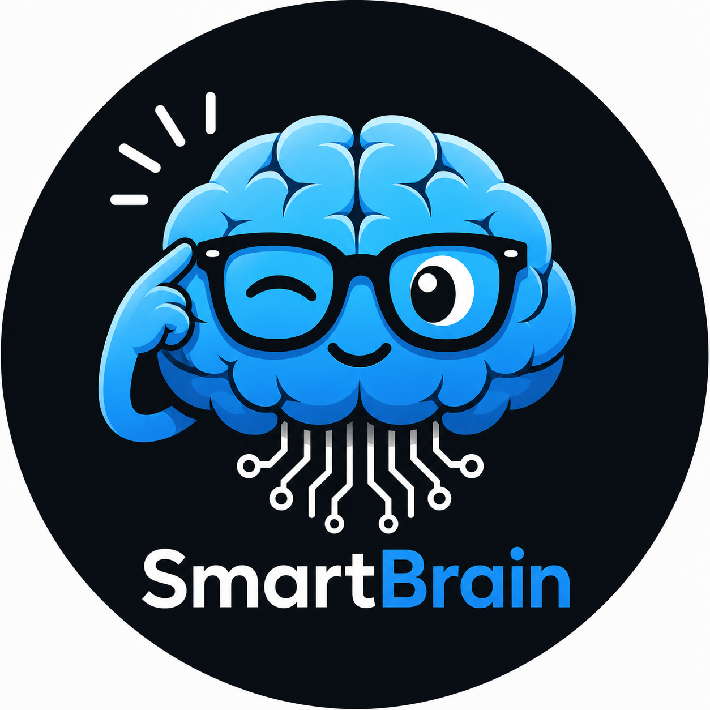
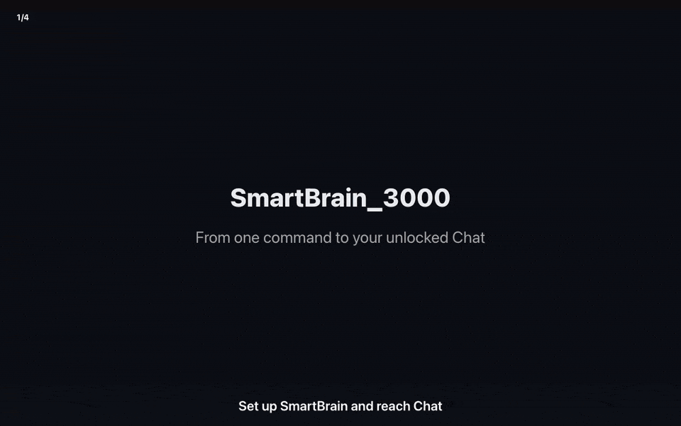

<p align="center">
  
</p>

# SmartBrain_3000

A personal AI assistant that runs **entirely on your own machine** — your
knowledge, your AI models, and your credentials stay on your hardware, encrypted
at rest under a passphrase only you hold. Your data never leaves your hardware
unless you explicitly choose otherwise — and there are exactly two ways to choose:

- **Cloud models (optional).** Run fully local models (MLX/Ollama) and every prompt
  stays on-box — the suggested path whenever your hardware can carry one. Add a
  cloud provider key instead and what you send that model (including knowledge
  content it is given) goes to that provider — your choice, per model.
- **Remote phone access (optional).** If you turn it on, your Desktop connects to a
  **content-blind** signaling node to set up an end-to-end-encrypted link to your
  phone (the SecureCloudGroup-hosted `rtc.securecloudgroup.com` by default, or your
  own via `SMARTBRAIN_SIGNALING_URL`). It sees the connection setup — your two
  devices' addresses, and when they connect — and never your data, which is encrypted
  end to end; it keeps no log of who connected.

<p align="center">
  
  <br/><em>From one command to your unlocked Chat.</em>
</p>

## What it is

SmartBrain_3000 is a **fully local, single-user** AI assistant that runs on your
own computer — macOS, Windows, or Linux. The launcher assembles what it needs and
runs it directly, with no Docker and nothing else to install first — as a desktop
tray app, or headless under systemd on a Linux server. Containers remain a
first-class alternative wherever you prefer them.

- **Your choice of AI.** Bring your own API keys for OpenAI, Anthropic, or
  Google — or run **fully local models** with Ollama or Apple MLX. A built-in
  gateway routes between them.
- **Your data, encrypted on-device.** Your knowledge base, notes, plans, and
  secrets live in a local database, encrypted at rest under a passphrase only
  you hold. Real documents are welcome — a several-hundred-page PDF is fine.
- **Chat with tools, under your control.** The assistant can search your
  knowledge, track tasks, and act on your behalf — but anything that changes
  data or reaches out parks for your approval first, and every attempt is
  audited.
- **Talk to it.** Tap the mic (or hold Space) and dictate; have replies read aloud;
  or go fully hands-free in Conversation mode, with a wake word if you want one.
  Speech is transcribed on your own machine by a built-in engine — nothing to
  install, nothing sent anywhere. See [Voice](docs/03-features.md#voice).
- **Follow websites.** Subscribe to an RSS/Atom feed and it becomes a knowledge
  vault that fills itself; tag or delete many items at once. See
  [Feeds](docs/03-features.md#follow-websites-feeds).
- **It quietly improves itself — within hard bounds.** Opt in and SmartBrain reviews
  its own performance on the cadence you choose (default: every 8 hours) — locally,
  reversibly, one change at a time — learns your preferences, suggests routines worth
  automating, and tells you about every change it makes. See the docs on
  [Self-improvement](docs/03-features.md#self-improvement).
- **Group and share knowledge with Vaults.** Bundle documents into a **vault** to
  scope a search, share it as an encrypted file, or **publish it publicly** so others
  can **subscribe by URL** and stay up to date — signed, verified, and re-encrypted
  under each reader's own passphrase. See [Share knowledge with Vaults](docs/04-vaults.md).

## Quickstart

SmartBrain itself needs nothing else — no Docker, no Python, no accounts. On macOS and
Windows the install goes through a package manager (Homebrew on macOS, Scoop on
Windows); if you don't already have one, install it first with its own one-liner:

- **macOS — Homebrew** (if `brew` reports "command not found"), from [brew.sh](https://brew.sh):
  ```sh
  /bin/bash -c "$(curl -fsSL https://raw.githubusercontent.com/Homebrew/install/HEAD/install.sh)"
  ```
- **Windows — Scoop** (if `scoop` isn't recognised), from [scoop.sh](https://scoop.sh), in PowerShell:
  ```powershell
  Invoke-RestMethod -Uri https://get.scoop.sh | Invoke-Expression
  ```

Then install the SmartBrain app from **https://smartbrain.securecloudgroup.com**, or with
one command:

**macOS** — in the Terminal app:

```sh
brew install --cask securecloudgroup/tap/smartbrain
```

**Windows** — in Terminal or PowerShell, via [Scoop](https://scoop.sh):

```powershell
scoop bucket add securecloudgroup https://github.com/SecureCloudGroup/scoop-bucket
scoop install securecloudgroup/smartbrain
```

**Linux (x86_64)** — download the install script, read it, run it. It verifies the
release's signature and checksum, installs per-user (no root), and adds SmartBrain to
your app menu; `--headless` sets up a systemd `--user` service for a server instead:

```sh
curl -fsSLO https://raw.githubusercontent.com/SecureCloudGroup/SmartBrain_3000/main/installer/install-linux.sh
sh install-linux.sh          # desktop; or:  sh install-linux.sh --headless
```

Then `smartbrain start` — if that says *command not found*, log out and back in
(your shell picks up `~/.local/bin` once it exists). Prefer containers (or on arm/musl, where there is no native
build yet)? The Docker stack is one file:

```sh
curl -fsSLO https://raw.githubusercontent.com/SecureCloudGroup/SmartBrain_3000/main/compose/docker-compose.release.yml
docker compose -f docker-compose.release.yml up -d
```

Then open **http://localhost:33000**.

Homebrew and Scoop install a small **desktop launcher** — a menu-bar / tray app. On its
first start it downloads and verifies everything SmartBrain needs (a Python runtime, the
app itself, and the model gateway) into a folder it owns, then runs it and opens your
browser. That download is a few hundred megabytes, so allow a few minutes the first time;
after that it starts in seconds. The app runs at **http://localhost:33000**. In the app:

1. **Set a passphrase** and **save your Emergency Kit** (a one-time Recovery
   Key). There is no password reset — the Recovery Key is the only way back in
   if you forget your passphrase, so store it somewhere safe and offline.
2. **Connect a model** under **Settings**: add a cloud provider API key, or run a
   local model — **MLX** on an Apple-Silicon Mac, **Ollama** on any OS, or either one
   running on **another machine you own** (SmartBrain on a Linux box, models on a Mac's
   GPU — see [the models guide](docs/02-models.md#use-a-model-server-on-another-machine)).
   If one is already running locally, SmartBrain **detects it and offers a one-tap
   connect** right on the Chat screen.
3. **Start chatting.**

> **Does it need Docker?** Not on an **Apple-Silicon Mac**, **64-bit Windows**, or
> **x86_64 Linux** — those run it directly. **Intel Macs** install the same desktop app
> but fall back to Docker, because there is no native build for them; **arm/musl Linux**
> runs the Docker stack above. `SMARTBRAIN_NATIVE=0` forces the Docker path on any machine.

> **Building from source?** Contributors can `git clone` the repo and run
> `python3 installer/install.py install` (this needs Docker, git, and Python, and compiles
> the image locally). See
> [Install from source](docs/01-getting-started.md#install-from-source-for-contributors).

### See it in action

Short, silent clips (~15s each) for every step — the five **Quickstart** clips take you
from install to fully working; the rest are optional power-ups:

| Quickstart | Then |
| --- | --- |
| [1 · Install → unlocked](docs/assets/gifs/01-install-to-unlocked.gif) | [6 · Planner](docs/assets/gifs/06-planner.gif) |
| [2 · Connect a model](docs/assets/gifs/02-connect-a-model.gif) | [7 · Schedules](docs/assets/gifs/07-schedule-a-prompt.gif) |
| [3 · Your first chat](docs/assets/gifs/03-first-chat.gif) | [8 · Pair a phone](docs/assets/gifs/08-pair-a-phone.gif) |
| [4 · Add knowledge & search](docs/assets/gifs/04-add-knowledge.gif) | [9 · Backup & recovery](docs/assets/gifs/09-backup-recovery.gif) |
| [5 · Approve an action](docs/assets/gifs/05-approve-an-action.gif) | [10 · Vaults — share knowledge](docs/assets/gifs/10-vaults.gif) |
| | [11 · Vaults — subscribe & update](docs/assets/gifs/11-vault-subscribe.gif) |

### Updating

**SmartBrain updates itself — there is no command to run.** The launcher looks for a new
release in the background and downloads it without disturbing what you're doing. Once it's
ready, the app itself says so and offers **Install now**; the same update is offered in the
menu as **Install update now** / **Install on next start**. Installing restarts SmartBrain
(under a minute), so you unlock again afterwards. Ignore the notice and the update installs
the next time you start. The desktop app updates itself the same way, so `brew upgrade` and
`scoop update` are no longer part of normal use. Don't want to wait for the background check?
**Check for updates** in the menu looks right now. Installing keeps the previous version on
disk for rollback and prunes anything older; a download that fails says so in the menu.

- **Which version am I on?** The menu names it, and so does the app under the logo, top-left
  — and **Settings → Status** shows it alongside the lock state, model server, voice engine,
  schedules, feeds and paired devices, which is the first place to look when something is off.
- **From a paired phone** you can see that an update is waiting, but installing it is
  Desktop-only.
- **Linux desktop** launchers relaunch themselves after an update, so the tray icon comes back
  on its own.
- **Headless Linux** swaps under systemd and the unit's `Restart=` brings up the new
  version — nothing to run there either.
- **On the Linux Docker stack:** no launcher does it for you — re-run `docker compose -f docker-compose.release.yml pull`
  then `docker compose -f docker-compose.release.yml up -d`.
- **From source:** `python3 installer/install.py update` backs up your encrypted data first, then rebuilds, restarts, and verifies — prompting before changes, on the host, never inside the container.

An update never touches your data. It lives in a folder you own
(`~/Library/Application Support/SmartBrain/data` on macOS, `~/.local/share/smartbrain/data`
on Linux); the Linux Docker stack keeps it in named Docker volumes.

## Going further (optional)

These are advanced tiers — none are needed for the Quickstart above:

- **Gmail** — connect a Gmail account (your own Google OAuth client, loopback
  flow) so the assistant can read and draft mail. See the
  [docs](docs/03-features.md#email-gmail).
- **Your phone, from anywhere** — pair a phone to reach your assistant on Wi-Fi
  or cellular over an end-to-end-encrypted WebRTC link, with no router
  port-forwarding. Off by default. See [Remote access](docs/08-remote-access.md).
- **Your knowledge in another AI client** — SmartBrain is also an MCP server, so
  Claude Desktop, Cursor, or any MCP client can search and read your knowledge base
  (read-only, loopback, behind a token you mint). Off until you generate that token.
  See [Connect external tools](docs/05-mcp.md).

Full guide: **[docs/](docs/README.md)** (also available in-app under **Help**).

## License — source-available (not open source)

SmartBrain_3000 is licensed under the **Elastic License 2.0 (ELv2)**. It is
**source-available, not OSI "open source."** In plain terms:

- ✅ You may use, self-host, and modify it for free — including inside a
  business, for your own use.
- ❌ You may **not** offer it to others as a hosted or managed service, resell
  it, or ship a competing product built from it.

See [LICENSE](LICENSE) for the full terms.

More: **[Changelog](CHANGELOG.md)** · **[Contributing](CONTRIBUTING.md)** ·
**[Security policy](SECURITY.md)** ·
**[Ask a question](https://github.com/SecureCloudGroup/SmartBrain_3000/discussions)**

© 2026 The Frels Holdings LLC. "SmartBrain", "SmartBrain_3000", and
"SmartBrain AI" are trademarks of The Frels Holdings LLC.

## Getting help

Stuck, or something didn't work the way this page said it would? Ask in
[Discussions](https://github.com/SecureCloudGroup/SmartBrain_3000/discussions) —
questions about installing, connecting a model, or getting your documents in are
all welcome, and no question is too basic. Found a reproducible bug? Open an
[issue](https://github.com/SecureCloudGroup/SmartBrain_3000/issues).

A word on response times: SmartBrain_3000 is built and maintained **part-time**.
Everything posted here gets read, and issues are addressed as quickly as
possible — data-safety problems first, broken installs next, everything else
after that — but there is no guaranteed turnaround. The best way to speed a fix
along is a clear report: what you did, what you expected, what happened instead,
and the relevant lines from **Open logs** in the menu.

## Security

Please report security issues **privately** — see [SECURITY.md](SECURITY.md)
(contact: `info@securecloudgroup.com`). Do not open public issues for
vulnerabilities.
