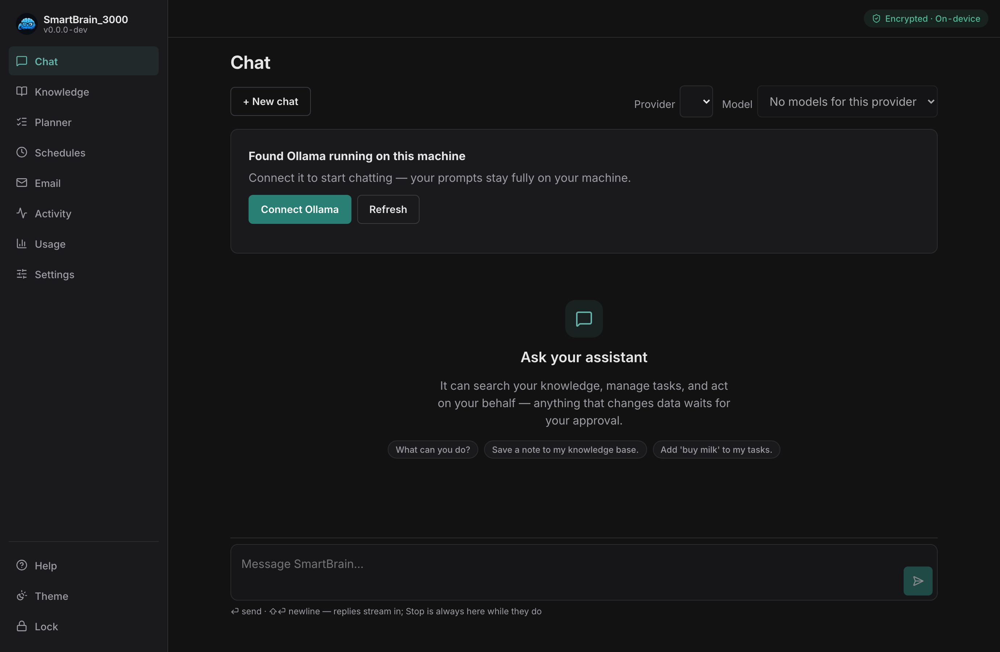
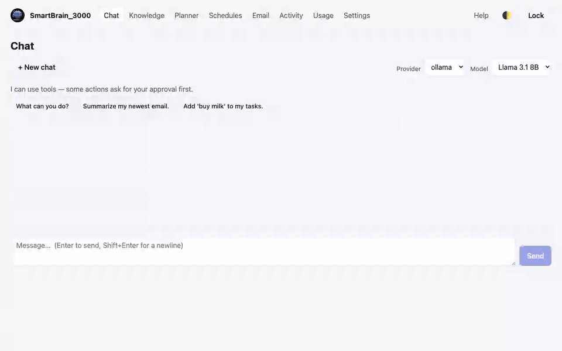

# Getting started

SmartBrain_3000 is a **local-first, single-user AI assistant** that runs entirely
on your own machine within a container (Docker). Your data and credentials stay on-box, encrypted
at rest. The only outbound calls it makes are to services you explicitly opt into:
the AI providers you configure, and Google's APIs if you connect Gmail. See
[Privacy &amp; security](06-privacy-security.md) for the full picture.

## What you need

- **Docker** — Docker Desktop (macOS/Windows) or Docker Engine / Colima (Linux/macOS).
- **Python 3** — only to run the installer.
- **git** — to clone the repository.

That's it. The app image is built locally from this repository; no GitHub or
registry account is required, and there are no config files to edit.

## Install

The fastest way (macOS / Linux) — one line that clones and installs:

```sh
curl -fsSL https://raw.githubusercontent.com/SecureCloudGroup/SmartBrain_3000/main/installer/bootstrap.sh | sh
```

It checks your prerequisites, clones the repo into the current folder, and runs the
installer. It installs nothing system-wide and edits no files; if a prerequisite is
missing it tells you what to install and stops.

Prefer to do it by hand (and on **Windows**)? Clone the repo, then run the installer
from the project folder — the same command on every OS:

```sh
git clone https://github.com/SecureCloudGroup/SmartBrain_3000.git
cd SmartBrain_3000
python3 installer/install.py install
```

(The thin wrappers `installer/install.sh` and `installer/install.ps1` just call that
line if you'd rather double-click.)

The installer checks your prerequisites, builds the image, starts the stack, and
waits until the app is healthy. The **first run builds the image, so it takes a few
minutes**. When it finishes it opens **http://localhost:33000** for you.

If anything looks off later, run the doctor — it both **checks and offers to fix**
common problems (start Docker, restart the stack, pull the embedding model):

```sh
python3 installer/install.py doctor
```

## First run

The first time you open the app it walks you through setup:

1. **Choose a passphrase** (at least 8 characters). This encrypts everything.
2. **Save your Emergency Kit.** You'll be shown a **Recovery Key** *once*. Store it
   somewhere safe and offline (print it, or put it in a password manager).
   - There is **no server and no password reset**. If you forget your passphrase,
     the Recovery Key is the *only* way back into your data.
3. You're now **unlocked** and ready to use the app.

## Your first 5 minutes

A quick path from zero to seeing what SmartBrain does:

1. **Connect a model.** Open **Chat**. If you're already running Ollama, you'll see
   *"Found Ollama running on this machine"* — tap **Connect** and you're set. No
   Ollama? Add a cloud key under **Settings → Cloud providers**, or
   [install Ollama](https://ollama.com/download) and pull a model
   (`ollama pull llama3.1:8b`). See [Connect a model](02-models.md).

   


2. **Send your first message.** Ask it anything — e.g. *"What can you help me with?"*
3. **Add something to Knowledge.** Open **Knowledge**, add a note or drop in a PDF,
   then **Reindex** so semantic search can find it. Now ask Chat about it.
4. **Watch the approval flow.** Ask the assistant to *"add a task to call the dentist
   tomorrow."* Because creating a task changes data, it **parks for your approval** in
   **Activity** instead of acting on its own. Open **Activity** and approve it.
5. **That's the core loop:** the assistant can read freely, but anything that changes
   data or reaches out waits for your **OK** — and every attempt is audited.

## Locking and unlocking

- Use **Lock** (top right) to drop the key from memory — your data is sealed until
  you unlock again. Locking also clears your provider keys from the gateway.
- **Unlock** with your passphrase. Forgot it? Choose **Unlock with Recovery Key**
  and enter the key from your Emergency Kit (dashes and letter case don't matter).

## Updating

To move to a newer version, run:

```sh
python3 installer/install.py update
```

`update` does it all: it **backs up your encrypted data first**, pulls the latest
code, rebuilds the image, restarts the stack, and verifies it's healthy. It prompts
before making changes, and runs from your machine (the host), never from inside the
container. (More on backups: [Backup &amp; recovery](05-backup-recovery.md).)

## Troubleshooting

Most first-run problems are one of these:

- **"Docker daemon not reachable" / the build fails immediately.** Docker isn't
  running. Start Docker Desktop (or `colima start`), then re-run the install.
  `python3 installer/install.py doctor` can start the stack for you.
- **The page won't load at http://localhost:33000.** Give a first run another minute
  (it builds the image), then run `doctor`. Still stuck? Check the logs:
  `docker compose -f compose/docker-compose.yml logs smartbrain`.
- **Chat says "No models available."** You haven't connected a model yet. If Ollama
  is running, the Chat screen offers a one-tap **Connect**; otherwise add a cloud key
  under **Settings → Cloud providers**. See [Connect a model](02-models.md).
- **Semantic search returns keyword results ("degraded").** The embedding model isn't
  pulled. On the Desktop run `ollama pull nomic-embed-text:v1.5` (the installer and
  `doctor` try to do this for you), then **Reindex** in Knowledge.
- **The browser warns about the certificate** (only if you set up LAN/HTTPS). Trust
  the local mkcert CA — see [Remote access](07-remote-access.md).

## Next

- [Connect a model](02-models.md) — add a cloud provider key or a local model.
- [Using SmartBrain_3000](03-features.md) — chat, knowledge, planner, schedules, email.
