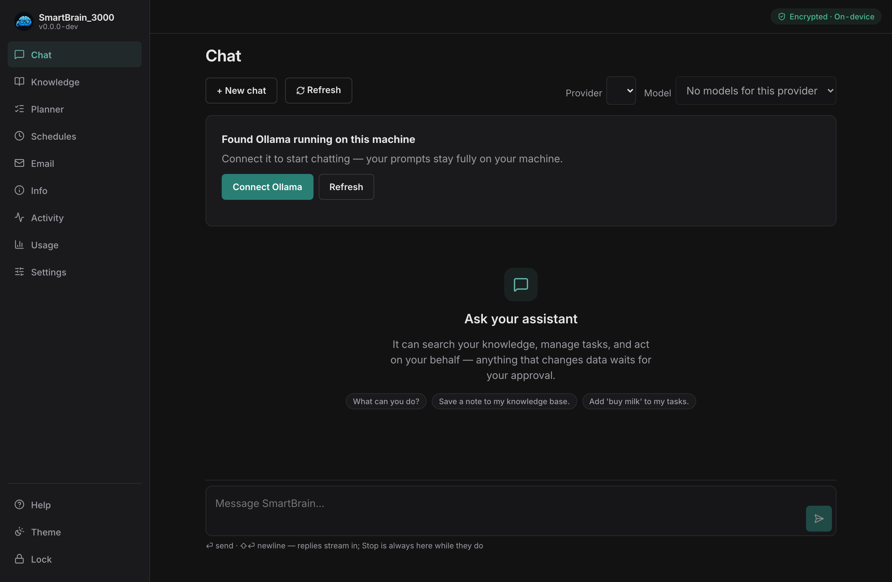
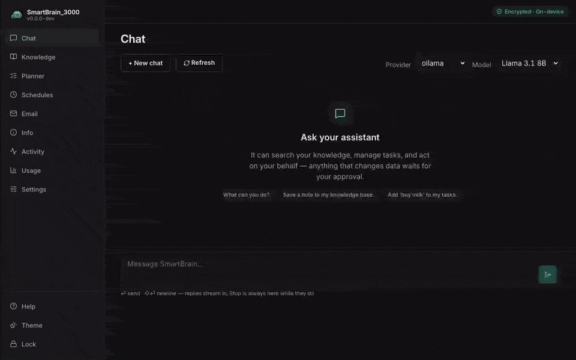

# Getting started

SmartBrain_3000 is a **local-first, single-user AI assistant** that runs entirely
on your own machine. Your data and credentials stay on-box, encrypted
at rest. The only outbound calls it makes are to services you explicitly opt into:
the AI providers you configure, and Google's APIs if you connect Gmail. See
[Privacy &amp; security](07-privacy-security.md) for the full picture.

## What you need

On **macOS and Windows**: nothing. There is no Docker to install, no Python, no accounts,
and no config files to edit. SmartBrain brings its own runtime — on first start the desktop
app downloads a Python runtime, the app itself, and the model gateway, checks each one
against a checksum, and runs them as two ordinary programs on your machine.

Two cases need [Docker](https://docs.docker.com/get-docker/) installed and running:

- **Linux** — there is no desktop app for Linux yet, so it runs the Docker stack.
- **Intel Macs** — they install the same desktop app as Apple Silicon, but there is no
  native build for them, so it falls back to running SmartBrain in Docker.

Everything else in this guide works the same on all of them.

## Install

Install the SmartBrain **desktop app** — a small menu-bar / system-tray launcher that
starts SmartBrain and opens it in your browser. The download page is
**https://smartbrain.securecloudgroup.com**, or run the command for your system:

**macOS** — in the Terminal app:

```sh
brew install --cask securecloudgroup/tap/smartbrain
```

**Windows** — in Terminal or PowerShell, using [Scoop](https://scoop.sh):

```powershell
scoop bucket add securecloudgroup https://github.com/SecureCloudGroup/scoop-bucket
scoop install securecloudgroup/smartbrain
```

**Linux** — no desktop app yet. Download the release compose file and start it:

```sh
curl -fsSLO https://raw.githubusercontent.com/SecureCloudGroup/SmartBrain_3000/main/compose/docker-compose.release.yml
docker compose -f docker-compose.release.yml up -d
```

Open **http://localhost:33000** and complete first-run setup below. Your data lives in
named Docker volumes; back it up with the in-app encrypted backup.

On macOS the launcher starts by itself once Homebrew finishes; on Windows, open
**SmartBrain** from the Start menu. The menu-bar icon shows what it is doing. The first
start downloads a few hundred megabytes, so give it a few minutes — the status line reads
*"Downloading SmartBrain…"*, then *"Starting (native)…"*, then *"Running ● (native)"*.
After that it starts in seconds and your browser opens at **http://localhost:33000**. Then
complete first-run setup below.

On macOS and Windows, everything the desktop app installs lives in one folder you own,
alongside your data:

| | Folder |
| --- | --- |
| macOS | `~/Library/Application Support/SmartBrain` |
| Windows | `%APPDATA%\SmartBrain` |

(The Linux Docker stack keeps its data in named Docker volumes instead.)

### If an install is misbehaving: a clean upgrade

On macOS and Windows, rarely — usually after an interrupted first start, or on a machine
that ran an early Docker build — the launcher can end up with a half-finished install or a
leftover container holding port 33000. This resets it without touching your data.

Try **Restart** in the menu first — it is faster and fixes most of what goes wrong. If that
doesn't do it, work through the four steps below. They take a couple of minutes and are the
right answer for a half-finished install or a stuck port.

1. **Stop it.** In the menu-bar / tray menu choose **Stop**, then **Quit launcher**.
   (**Quit launcher** on its own leaves SmartBrain running — **Stop** is what shuts it
   down.)
2. **Clear any leftover containers**, if that machine ever ran the Docker path:

   ```sh
   docker rm -f smartbrain_3000 smartbrain_bifrost
   ```

3. **Upgrade the launcher** — `brew upgrade --cask smartbrain` on macOS,
   `scoop update smartbrain` on Windows.
4. **Start SmartBrain again** and watch the menu. It re-downloads whatever is missing and
   settles on **Running ● (native)**; the line under it names the version now running.

Your database is in the `data` folder above and none of these steps touch it. To force a
full re-download of the runtime, delete the `native` folder next to it — that folder holds
only downloaded parts and is rebuilt on the next start.

If even that leaves the install broken, there is one more step — a full reset, which removes
everything SmartBrain put on the machine and reinstalls it. It is slow and deliberate, and
almost nobody needs it: see
[Backup & recovery → Starting completely fresh](06-backup-recovery.md#starting-completely-fresh).

### Install from source (for contributors)

Building from the repo uses **Docker** and additionally needs **git** and **Python 3**,
and is slower — it compiles the image locally. Use it when you're developing on the code:

```sh
git clone https://github.com/SecureCloudGroup/SmartBrain_3000.git
cd SmartBrain_3000
python3 installer/install.py install
```

A from-source install keeps its data in the repo's own `data/` directory, not in the
folder above.

## First run

The first time you open the app it walks you through setup:

1. **Choose a passphrase** (at least 8 characters). It encrypts your SmartBrain
   data — chats, documents, and settings — so only you can read them.
2. **Save your Emergency Kit.** You'll be shown a **Recovery Key** *once*. Store it
   somewhere safe and offline (print it, or put it in a password manager).
   - There is **no server and no password reset**. If you forget your passphrase,
     the Recovery Key is the *only* way back into your data.
3. You're now **unlocked** and ready to use the app.

## Your first 5 minutes

A quick path from zero to seeing what SmartBrain does:

1. **Connect a model.** Open **Chat**. If a local model server is already running you'll
   see *"Found … running on this machine"* — tap **Connect** and you're set. Nothing
   running yet? Add a cloud key under **Settings → Cloud providers**, or start a local
   model — **MLX** on an Apple-Silicon Mac, or [Ollama](https://ollama.com/download) on any
   OS (`ollama pull qwen2.5:7b-instruct`). See [Connect a model](02-models.md).

   


2. **Send your first message.** Ask it anything — e.g. *"What can you help me with?"*
3. **Add something to Knowledge.** Open **Knowledge**, add a note or drop in a PDF — it's
   indexed automatically within seconds. Now ask Chat about it.
4. **Watch the approval flow.** Ask the assistant to *"add a task to call the dentist
   tomorrow."* Because creating a task changes data, it **parks for your approval** in
   **Activity** instead of acting on its own. Open **Activity** and approve it.
5. **That's the core loop:** the assistant can read freely, but anything that changes
   data or reaches out waits for your **OK** — and every attempt is audited.

## Locking and unlocking

- Use **Lock** (top right) to drop the key from memory — your data is sealed until
  you unlock again. Locking also clears your provider keys from the gateway.
- **Unlock** with your passphrase. Forgot it? Choose **Use recovery key**
  and enter the key from your Emergency Kit (dashes and letter case don't matter).

## Updating

**SmartBrain updates itself — no commands.** The launcher checks for a newer version in the
background and downloads it quietly, without disturbing a session in progress. The download
is separate from the install, so nothing changes under you until you say so.

When an update is ready you're told in two places:

- **In SmartBrain itself**, a strip at the top of the page: *"SmartBrain v0.8.12 is ready to
  install. Installing restarts it — under a minute, and you'll unlock again afterwards."*
  Click **Install now** to apply it. The page reconnects and reloads by itself when the new
  version comes up — there's nothing to click twice. Dismissing the notice hides that
  version and stays quiet until a newer one arrives.
- **In the menu-bar / tray menu**, as **Install update now** and **Install on next start**.

Ignore it entirely and the update installs the next time you start SmartBrain. Either way
you jump straight to the newest version, even if you're several behind. Because the key is
never kept on disk, an install leaves the app **locked** — you unlock again afterwards.

Installing is **Desktop-only**. A **paired phone** can see that an update is waiting but
can't restart your machine over the network; the phone app itself refreshes the next time
you open it.

**Which version is running?** The app shows it under the logo, top-left, and the menu-bar
menu names it too. During an update, when the launcher has been replaced but the app it
supervises hasn't yet, the menu names both numbers rather than one misleading one.

If SmartBrain updates while you have a page open, that page notices and offers a **Reload**:
*"SmartBrain updated to v0.8.12 while this page was open — reload to use the new version."*
You can dismiss it and keep working on the old page.

The launcher updates itself on the same schedule, so `brew upgrade --cask smartbrain` and
`scoop update smartbrain` are not part of normal use — they're there if you ever need to
force it.

**From source:** `python3 installer/install.py update` — it **backs up your encrypted data first**,
pulls the latest code, rebuilds the image, restarts the stack, and verifies it's healthy. It prompts
before making changes and runs on the host, never inside the container.

Your data lives in the `data` folder named under **Install** above, and an update never
touches it. (More on backups: [Backup &amp; recovery](06-backup-recovery.md).)

## Troubleshooting

### Ask the doctor first

If you have Python 3 and a copy of the repository, one command inspects this computer's
install and says what is wrong in plain words — it needs no running app, which is exactly
when you want it:

```sh
python3 installer/doctor.py
```

It changes nothing. Add `--fix` and it offers each safe repair one at a time, describing
what it will do before it does it; it never touches your data. It knows about half-finished
downloads, records pointing at processes that are gone, ports held by something else, a
gateway that has quietly died under a running app, a locked vault, a model server that
isn't answering, staged updates, and low disk space.

The rest of this section is what those problems look like from the menu.

Most first-run problems are one of these:

- **The page won't load at http://localhost:33000.** Give a first start a few more minutes —
  it's downloading a few hundred megabytes, and the menu's status line says what it's doing.
  Once that line reads **Running ●**, click **Open SmartBrain** in the menu.
- **"Download failed — nothing was changed; check the log and Restart."** The download of the
  runtime didn't finish (no connection, a proxy, or not enough disk space). Nothing on your
  machine was altered. Fix the cause and click **Restart** in the menu.
- **"SmartBrain keeps crashing — stopped restarting; see the native logs."** The launcher
  restarts a stopped SmartBrain, but gives up after three tries in ten minutes rather than
  spinning. The logs are `native/run/app.log` and `native/run/bifrost.log` inside the folder
  named under **Install** above.
- **"Native start failed — see the log."** Open `native/run/app.log`. If it says an instance
  is *already serving on port 33000*, something else holds that port — usually a SmartBrain
  a previous launcher started and never stopped. Choose **Stop** in the menu, then
  **Restart**; if it persists, follow **If an install is misbehaving: a clean upgrade**
  under **Install** above.
- **macOS asks if SmartBrain may "access data from other apps."** Click **Allow**, or don't —
  the launcher is checking whether Docker is installed, which it only needs as a fallback.
  It reads nothing else, and declining doesn't stop SmartBrain from running.
- **Chat says "No models available yet."** You haven't connected a model. If a local
  model server (MLX or Ollama) is running, the Chat screen offers a one-tap **Connect**;
  otherwise add a cloud key under **Settings → Cloud providers**. See
  [Connect a model](02-models.md).
- **Every answer is slow, by several seconds, always.** A local model server can be
  configured to reload the model on every single request. SmartBrain notices and writes a
  line to `native/run/app.log` naming the model and the seconds lost, with what to check
  (a draft/speculative-decoding option pointed at an incompatible model, or an
  idle-unload setting). It isn't shown in the app — read the log if answers feel
  uniformly slow.
- **Semantic search returns keyword results ("degraded").** No embedding model is set
  up for your backend. See [Embeddings](02-models.md#embeddings-for-knowledge-search) for
  your setup, then **Reindex** in Knowledge.
- **The browser warns about the certificate** (only if you set up LAN/HTTPS). Trust
  the local mkcert CA — see [Remote access](08-remote-access.md).
- **"Database is newer than this app" / a restore is refused.** Pointing an older build
  at a newer data directory, or restoring a backup from a newer version, is refused on
  purpose to prevent data loss. Let SmartBrain update itself first, then reopen or retry
  the restore.

On **Linux** and **Intel Macs**, where SmartBrain runs in Docker, two more apply:

- **"Docker is required — install it, start it, then click Restart."** Install
  [Docker](https://docs.docker.com/get-docker/) — the launcher opens the download page for
  you the first time — then click **Restart** in the menu. Docker Desktop's very first
  launch asks you to accept its terms; do that before continuing.
- **"Docker isn't running — start Docker, then Restart."** The daemon is installed but
  stopped. Start Docker Desktop (or `colima start`), then **Restart**. To read the logs:
  `docker compose -f docker-compose.release.yml logs smartbrain`, run from the folder
  named under **Install** above.

## Uninstall

**An uninstall never removes your data.** Removing SmartBrain is two steps, and the second
one is yours to take deliberately.

1. **The app.** Stop it first (**Stop** in the menu), then remove it however you installed
   it: `brew uninstall --cask smartbrain` on macOS, `scoop uninstall smartbrain` on
   Windows, `docker compose -f docker-compose.release.yml down` on Linux. From source,
   `docker compose down` in `compose/`.

   On macOS you can add `--zap` to clear what the app downloaded as well:
   `brew uninstall --zap --cask smartbrain`. That removes the assembled runtime, the logs,
   the launcher's bookkeeping, and the gateway's configuration — which holds provider keys
   the app pushed into it, so clearing it is the point. **It does not touch your `data`
   folder**, and neither does a plain uninstall.

2. **Your data**, if and when you want it gone. It is the single folder named under
   **Install** above, with `data` inside it:

   | | Delete |
   | --- | --- |
   | macOS | `~/Library/Application Support/SmartBrain` |
   | Windows | `%APPDATA%\SmartBrain` |

   On Linux the data is in Docker volumes, so it goes with the stack:
   `docker compose -f docker-compose.release.yml down -v`. The `-v` is what deletes the
   volumes — without it your data stays.

   Take a **Download encrypted backup** first if there's any chance you'll want it back —
   see [Backup & recovery](06-backup-recovery.md). There is no way to recover it afterwards.

   (From source, data lives in the repo's `data/` directory instead — delete that.)

## Next

- [Connect a model](02-models.md) — add a cloud provider key or a local model.
- [Using SmartBrain_3000](03-features.md) — chat, knowledge, planner, schedules, email.
