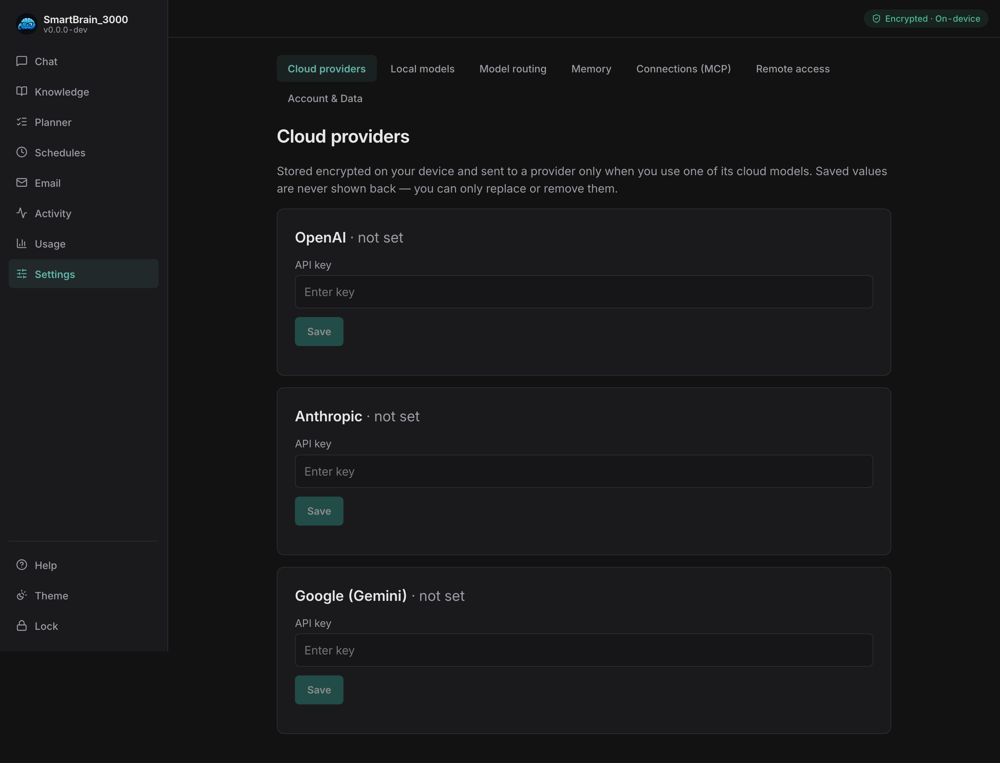
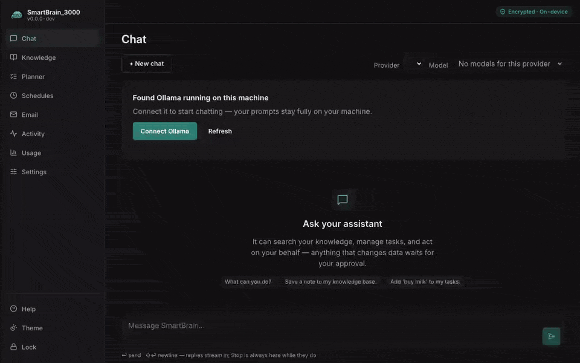
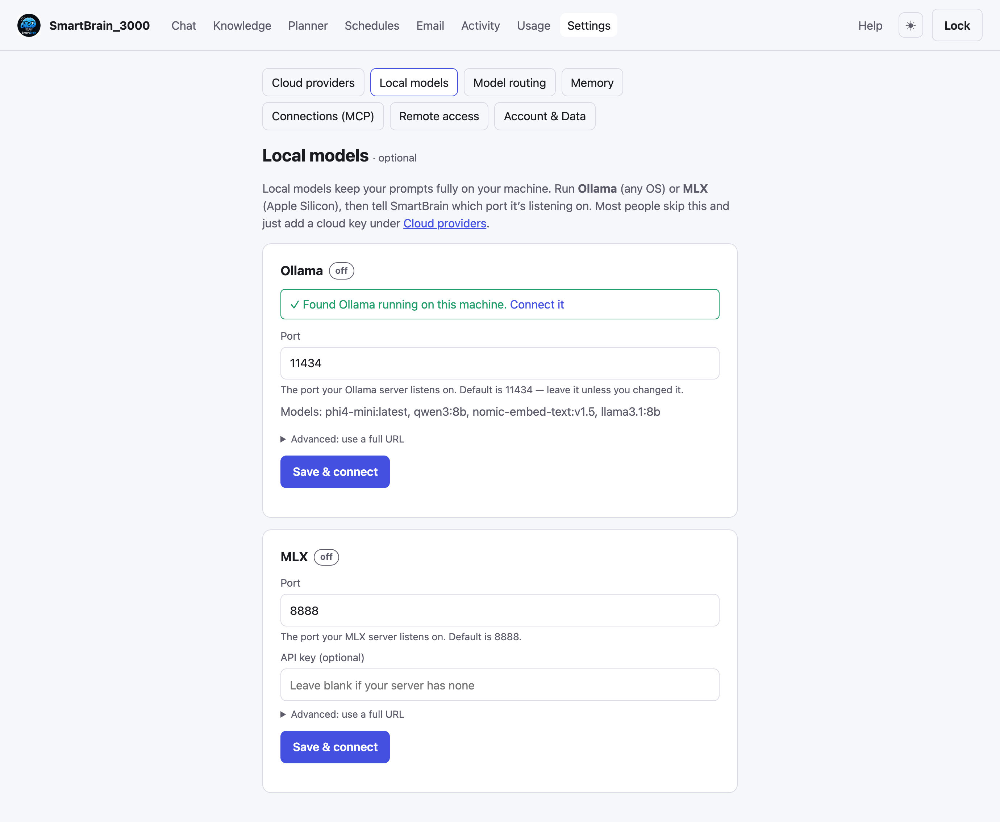

# Connect a model

SmartBrain_3000 talks to language models through a local **gateway** (Bifrost),
which runs as part of the stack. You can use **cloud providers** (with your own
API keys) and/or **local models** running on your machine. Nothing is sent to a
provider unless you configure it and use it.

## Cloud providers (your API keys)

Open **Settings → Cloud providers** and add a key for any of:

- **OpenAI**
- **Anthropic**
- **Google (Gemini)**





Keys are stored **encrypted on your machine** and pushed to the local gateway
while you're unlocked; locking removes them from the gateway again. The app never
returns a stored key over its API — only the fact that one is set.

> Using a cloud model means your prompts (and any content you send) go to that
> provider. If you'd rather keep everything on your machine, use a local model.

## Local models (on your machine)

Local models keep every prompt on your hardware — nothing goes to a provider. They run on
the **host** (not inside the container), and the app reaches them at `host.docker.internal`.
SmartBrain supports two backends and connects to either the same way:

- **MLX** — Apple's on-device runtime for **Apple-Silicon Macs** (M-series). It's the fastest
  path on a Mac, so it's the one to reach for first there. Install `mlx-lm`
  (`pip install mlx-lm`) and start a server for a model:

  ```sh
  mlx_lm.server --host 0.0.0.0 --port 8888 --model mlx-community/Qwen2.5-7B-Instruct-4bit
  ```

- **Ollama** — works on **any OS** (macOS, Linux, Windows). [Install it](https://ollama.com/download),
  then pull a model:

  ```sh
  ollama pull qwen2.5:7b-instruct
  ```

**Which model?** For local chat we suggest **Qwen2.5-7B-Instruct** — it follows instructions
and drives the assistant's tools reliably at a size that runs comfortably on a laptop. That's
`mlx-community/Qwen2.5-7B-Instruct-4bit` on MLX, or `qwen2.5:7b-instruct` on Ollama. Any
tool-capable model works; the Chat model picker lists whatever your server has.

Open **Settings → Local models** to connect a backend by port. The panel shows whether each
is reachable and which models it has.

> **Already running MLX or Ollama?** You usually don't need to touch this panel. SmartBrain
> **detects** a local MLX (`:8888`) or Ollama (`:11434`) server on its default port and offers
> a one-tap **Connect** — on the **Chat** screen when you have no model yet, and here under the
> port field. The manual port/URL fields are for non-standard setups.



## Embeddings (for Knowledge search)

Semantic search in the [Knowledge base](03-features.md) needs an **embedding
model**. The default is a **local** `nomic-embed-text:v1.5`, served through Ollama, so
your knowledge content stays on-box. The same embedding model also runs on **MLX**, so an
Apple-Silicon Mac can run the whole stack MLX-only — point embeddings at your MLX server if
you're not running Ollama.

**The installer pulls this for you** when Ollama is present (and
`python3 installer/install.py doctor` offers to). If you ever need to do it by hand,
pull that exact tag:

```sh
ollama pull nomic-embed-text:v1.5
```

The tag matters: the bare `nomic-embed-text` won't resolve. If semantic search shows
keyword results and says *"degraded"*, this model isn't pulled — run the command above
and **Reindex**. You can change the model, but pointing embeddings at a cloud provider
sends your documents there on every reindex — only do that if you accept that tradeoff.

## Next

- [Using SmartBrain_3000](03-features.md) — start chatting and add knowledge.
- [Connect external tools](04-mcp.md) — let a desktop AI client (e.g. Claude Desktop) read your Knowledge.
