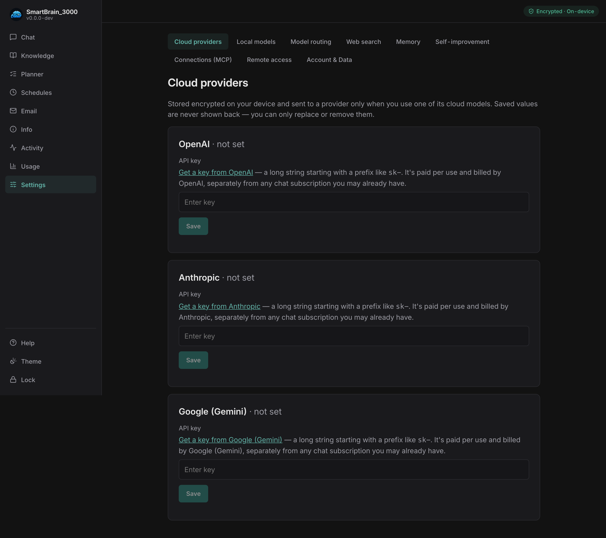
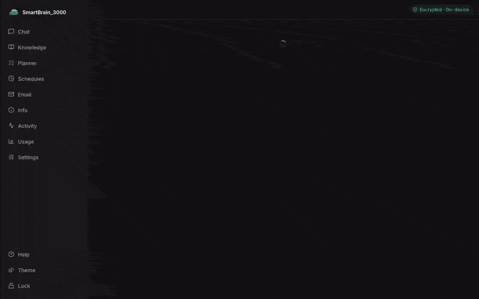
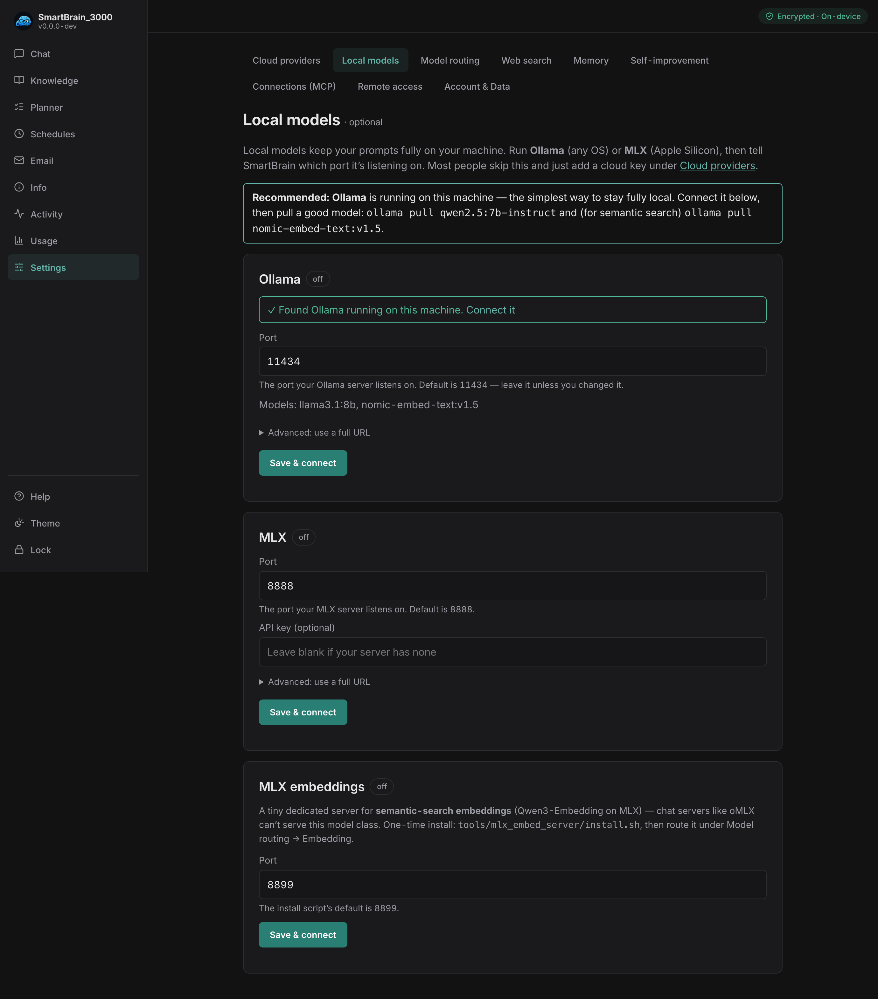

# Connect a model

SmartBrain_3000 talks to language models through a local **gateway** (Bifrost),
which runs on your machine alongside the app. You can use **cloud providers** (with your
own API keys) and/or **local models** running on your machine. Nothing is sent to a
provider unless you configure it and use it.

## Cloud providers (your API keys)

An API key is a long secret string you create in a provider's developer console. It is
**billed per use and is not the same thing as a consumer subscription** — a ChatGPT Plus
or Claude Pro plan does not include one, and paying for a plan does not give you a key.
Most providers ask for a card and bill cents per request at typical personal use. If you
would rather pay nothing and keep everything on your machine, skip this section entirely
and use [a local model](#local-models-on-your-machine) instead.

Open **Settings → Cloud providers** and add a key for any of:

- **OpenAI** — [platform.openai.com/api-keys](https://platform.openai.com/api-keys)
- **Anthropic** — [console.anthropic.com/settings/keys](https://console.anthropic.com/settings/keys)
- **Google (Gemini)** — [aistudio.google.com/apikey](https://aistudio.google.com/apikey)





Keys are stored **encrypted on your machine** and pushed to the local gateway
while you're unlocked; locking removes them from the gateway again. The app never
returns a stored key over its API — only the fact that one is set.

> Using a cloud model means your prompts (and any content you send) go to that
> provider. If you'd rather keep everything on your machine, use a local model.

## Local models (on your machine)

Local models keep every prompt on your hardware — nothing goes to a provider. You run the
model server yourself and SmartBrain reaches it over loopback on your own machine.
SmartBrain supports two backends and connects to either the same way:

- **MLX** — Apple's on-device runtime for **Apple-Silicon Macs** (M-series). It's the fastest
  path on a Mac, so it's the one to reach for first there. The easiest way to run it is an
  MLX **server app** (for example oMLX): download it, pick a model, and it serves on port
  `8888` — SmartBrain's one-tap Connect finds it from there. No Python, no terminal.

  Prefer the command line? `mlx-lm` works too (`pip install mlx-lm`, then):

  ```sh
  mlx_lm.server --port 8888 --model mlx-community/Qwen2.5-7B-Instruct-4bit
  ```

- **Ollama** — works on **any OS**, and is **the** local-model path on Windows and Linux
  (MLX is Apple-Silicon-only). [Install it](https://ollama.com/download), then pull a model:

  ```sh
  ollama pull qwen2.5:7b-instruct
  ```

**Which model?** For local chat we suggest **Qwen2.5-7B-Instruct** — it follows instructions
and drives the assistant's tools reliably at a size that runs comfortably on a laptop. That's
`mlx-community/Qwen2.5-7B-Instruct-4bit` on MLX, or `qwen2.5:7b-instruct` on Ollama. Any
tool-capable model works; the Chat model picker lists whatever your server has.

Open **Settings → Local models** to connect a backend by port. The panel shows whether each
is reachable and which models it has.

> **Already running MLX or Ollama?** You usually don't need to touch this panel. SmartBrain
> **detects** a local MLX (`:8888`) or Ollama (`:11434`) server on its default port and offers
> a one-tap **Connect** — on the **Chat** screen when you have no model yet, and here under the
> port field. The manual port/URL fields are for non-standard setups.



## Choosing a model in Chat

The **Chat** screen has a **Provider** and a **Model** picker above the conversation. It
opens on your routed Chat model (below); picking a different one there applies to that
session only and is never saved. Only chat-capable models are listed — an embedding model
can't hold a conversation, so it isn't offered.

If you pick a model that can't call tools, SmartBrain says so under the reply rather than
pretending: *"This model can't use tools, so it answered from its own knowledge only — web
search, tasks, knowledge, and email actions won't run."*

## Which model does what (Model routing)

**Settings → Model routing** decides which model serves which job. Every model you have
configured — cloud or local — can be pointed at any slot, and the list is discovered live
from your providers.

| Slot | What it serves | If you don't set it |
| --- | --- | --- |
| **Chat** | Ordinary conversation and the assistant's tool-using turns. | `openai/gpt-4o-mini`, which needs an OpenAI key — so this is the one slot worth setting deliberately. |
| **Agent tasks (schedules)** | Scheduled runs and background turns. These call tools, so pick a model that reliably tool-calls. | **Same as Chat** |
| **Embedding (semantic search)** | Turning your documents and queries into vectors for meaning search. Only embedding models are offered. | `ollama/nomic-embed-text:v1.5` |
| **Document summaries** | The background summary tree that makes "summarize this" instant on large documents. | Same as Chat |

Chat is the root: the two slots that say *Same as Chat* really do follow it, so setting Chat
alone is a complete configuration.

Two more things worth knowing:

- Changing **Embedding** only affects new items. Run **Reindex (semantic)** on the
  Knowledge page afterwards so existing documents stay searchable.
- **Document summaries** is the slot to change if you have a big-context cloud model and a
  book-sized library: it turns a summary tree that would trickle for hours on a small local
  model into minutes. Point it at a cloud model and your documents are sent to that provider
  as the tree is built — keep it on a local model if that matters to you.

The page also lists **Fast chat** and **Reasoning** slots. Nothing in the app requests them
today, so setting them changes nothing.

### Model context length

Under the routing table, **Model context length** tells SmartBrain how many tokens each
model can hold. That number sizes how much of a document, or how large a tool result, the
model is handed in one step — a bigger context means Chat reads and summarizes far longer
documents per step.

MLX servers report their own context length and are filled in automatically. Anything else
uses **8,192 tokens** until you set a value. Leave a field blank to go back to the default,
and use the model's real figure — this setting tells SmartBrain what the model can take, it
doesn't change what the model can take.

## Embeddings (for Knowledge search)

Semantic search in the [Knowledge base](03-features.md) needs an **embedding
model**. The default is a **local** `nomic-embed-text:v1.5`, served through Ollama, so
your knowledge content stays on-box.

**MLX-only stack (no Ollama):** the simplest path is to serve an **encoder embedding
model directly on your MLX chat server** — no second server needed. MLX server apps like
oMLX serve encoder-class embedders (ModernBERT/BERT family; a good pick is
`nomic-ai/modernbert-embed-base`): load it alongside your chat model, then route
Settings → Model routing → **Embedding** → `mlx/<that model>` and **Reindex**. Done —
one server runs everything.

They refuse *decoder* embedding models such as Qwen3-Embedding ("not an embedding
model"). Only if you specifically want one of those, use the bundled fallback: the
**MLX embeddings server** (`tools/mlx_embed_server/install.sh` — a tiny login service on
port 8899 serving `Qwen3-Embedding-0.6B` with correct pooling), connected under
Settings → Local models → **MLX embeddings** and routed to `mlxe/qwen3-embedding-0.6b`.

**Pull it yourself** once, with that exact tag:

```sh
ollama pull nomic-embed-text:v1.5
```

(A from-source install does this for you when Ollama is present, and
`python3 installer/doctor.py --fix` offers to pull it if it is missing.)

The tag matters: the bare `nomic-embed-text` won't resolve. If search says *"Showing
keyword results"*, no embedding model is in place — run the command above and
**Reindex**. You can change the model, but pointing embeddings at a cloud provider
sends your documents there on every reindex — only do that if you accept that tradeoff.

## Next

- [Using SmartBrain_3000](03-features.md) — start chatting and add knowledge.
- [Connect external tools](05-mcp.md) — let a desktop AI client (e.g. Claude Desktop) read your Knowledge.
