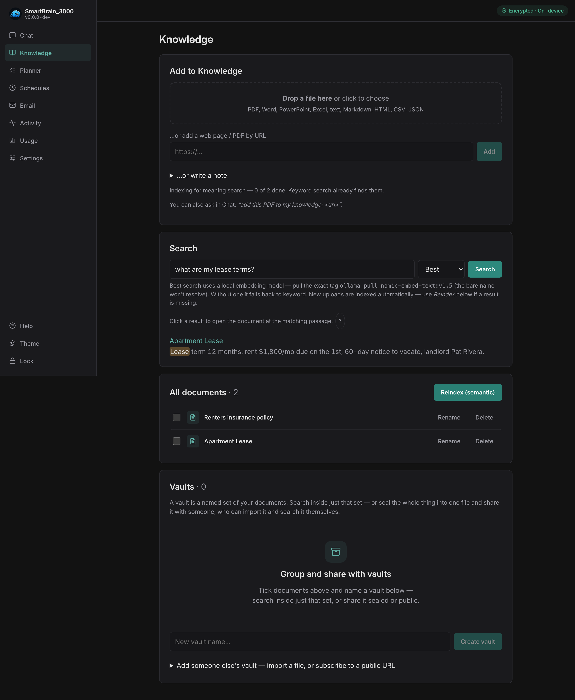
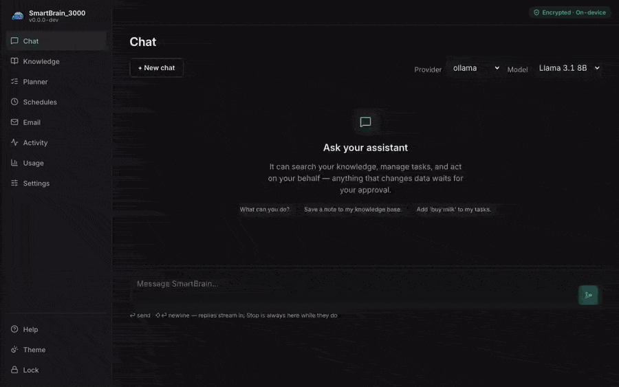
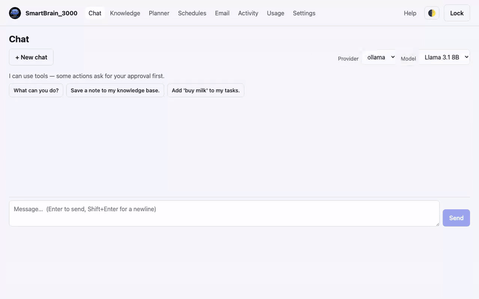
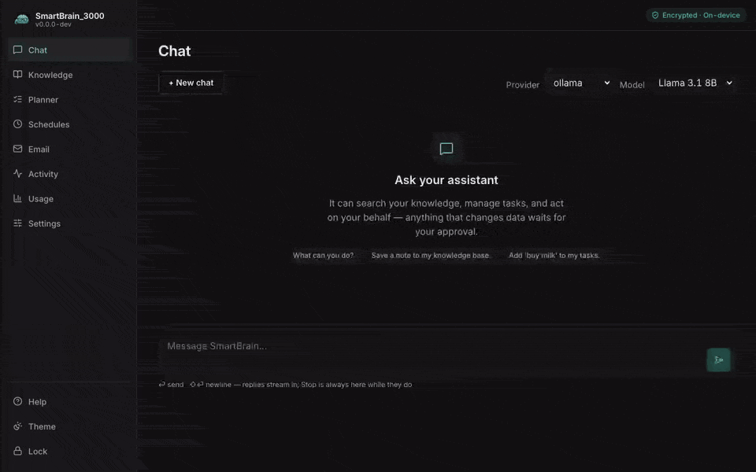

# Using SmartBrain_3000

Everything here runs locally and is encrypted at rest. Here's what each area does.

The **Desktop** is the main surface and shows everything below. On a **paired phone**
([Remote access](08-remote-access.md)) you get a trimmed set for use on the go — Chat,
Knowledge, Planner, Schedules, Email, and Activity — while Settings and setup stay on the Desktop.

## Chat

Talk to your assistant. Chat can optionally **use tools** to act on your behalf —
search your knowledge, **read or summarize a whole document**, **save a note back to
your knowledge**, add a task, fetch a public web page, send an email, and more. Replies
are formatted (headings, lists, tables, and code blocks render properly). You can
**Stop** an answer mid-stream, **Copy** any reply, **Regenerate** the latest one, and
**Rename** a saved chat.

Tools are **risk-tiered**, and this is the core safety idea:

- **Observe** (e.g. knowledge search) runs automatically — it only reads.
- **Reviewed / Irreversible** (e.g. add a task, send an email, delete a task) are
  **never run automatically**. The assistant *proposes* them and they wait for
  your approval in **Activity**. Irreversible actions need an extra confirmation.

So the assistant can draft and suggest, but anything that changes data or reaches
out requires your explicit OK. Every tool attempt is written to the audit log.

**For example:** ask *"search my knowledge for the lease terms"* and the assistant
reads and answers immediately (Observe). Ask *"email the landlord about it"* and it
**drafts** the message but **parks it in Activity** — nothing sends until you open
Activity and approve (Irreversible, with an extra confirm).

## Knowledge

A private, encrypted knowledge base. Drag in **PDFs, Word (.docx), PowerPoint (.pptx),
Excel (.xlsx), HTML and text files** — many files in one drop if you like — paste a URL,
or write a note. Uploads don't block: they land right away and a background indexer makes
them searchable within seconds. Adding the same content twice is a no-op — SmartBrain
recognises it and keeps the one copy rather than cluttering your results with duplicates.

Search your knowledge three ways:

- **Best** (default) — combines both of the below. Keyword search nails an exact name
  or invoice number; meaning search finds a paraphrase. Each misses what the other
  catches, so fusing them beats either alone.
- **Keyword** — ranks by relevance: rare words count for more, and a long document
  can't win just by being long. Needs no model at all.
- **Meaning** — matches by sense rather than wording, using an
  [embedding model](02-models.md).

**Results are citations.** Every hit shows where it came from — *"Lease.pdf · p.12"*
(a slide deck cites *slide 3*, a spreadsheet *sheet 2*) — and clicking it opens the
document **at the passage that matched**, highlighted, rather than at the top. Chat
answers that used your knowledge show the same source chips underneath the reply —
click one to open the document at the cited passage. The chips come from what the
assistant actually searched and read, not from what it *says* it did, so you can
check any claim against the original.

**Try it:** open **Knowledge**, drag in a document, and search it. Then ask **Chat**
*"what does my knowledge say about …"* — the assistant searches it for you and tells you
which file and page it got the answer from.

> Semantic search needs the embedding model pulled (the installer does this for you).
> If results say *"degraded"*, run `ollama pull nomic-embed-text:v1.5` on the Desktop
> and Reindex — see [Embeddings](02-models.md#embeddings-for-knowledge-search).

Your knowledge is also what external tools can read over [MCP](05-mcp.md).
Group documents into **vaults** to scope a search — and to share them, privately
or publicly: see [Share knowledge with Vaults](04-vaults.md).

## Planner

Simple task tracking — add tasks with optional due dates; they group into Today /
This week / Later. The assistant can propose new tasks (which you approve).

## Schedules

Run a prompt on a timer — e.g. "every morning, summarize my open tasks." A
schedule fires an assistant turn on its cadence. Two things to know:

- Schedules only run **while the app is unlocked** (a locked vault can't decrypt
  or act — there's no background access to your data).
- If a scheduled run wants to do something **dangerous** (send, delete, etc.), it
  **parks for your approval** in Activity just like in chat — it won't act alone.

Use **Run now** to fire one immediately.

## Email (Gmail)

Connect a Gmail account with **your own** Google OAuth client. The whole flow is
loopback-only — the authorization happens on your machine and nothing leaves it except
the calls to Google. SmartBrain asks for just two scopes: **read** and **send** (no
archive, delete, or label changes). It's optional; most people run SmartBrain without it.

**One-time setup** (the in-app **Email** page walks you through these):

1. Open [Google Cloud Console → Credentials](https://console.cloud.google.com/apis/credentials),
   then **Create credentials → OAuth client ID**, and choose type **Desktop app**. A Desktop-app
   client needs **no redirect URL** — Google handles loopback automatically.
2. On the **OAuth consent screen**, add the `gmail.readonly` and `gmail.send` scopes and set
   **Publishing status** to **In production** — otherwise Google signs you out every 7 days.
3. In the app's **Email** page, paste the client **ID** and **secret** and click **Connect Gmail**.
   A Google sign-in opens; if it warns the app is "unverified" (it's your own client), choose
   **Advanced → Continue**, then approve the two scopes.

Once connected you can read recent mail and compose/send:

- **You** sending from the app is a direct action.
- The **assistant** sending email is an **Irreversible** tool — it always parks
  for your approval first. It can draft; you approve the send.

## Usage & cost

A running estimate of what your **cloud** models cost. **Usage** shows estimated
spend per model over a date range (today, last 5/10/30 days, or a custom range),
computed from each provider's live pricing, with a total. **Local models (Ollama,
MLX) are free** and show as such. Usage appears here after you chat with a model;
none of your usage or token data leaves your machine — it's computed locally from your
token counts (the only network call is a local fetch of the model price list from the
on-device gateway).

## Activity

Your audit + approvals view:

- **Pending approvals** — review and approve/deny what the assistant proposed.
- **Audit log** — an encrypted record of every tool attempt (what, when, outcome).

## Next

- [Share knowledge with Vaults](04-vaults.md) — sealed shares, public publishing, subscriptions.
- [Connect external tools](05-mcp.md) via MCP.
- [Backup & recovery](06-backup-recovery.md).
