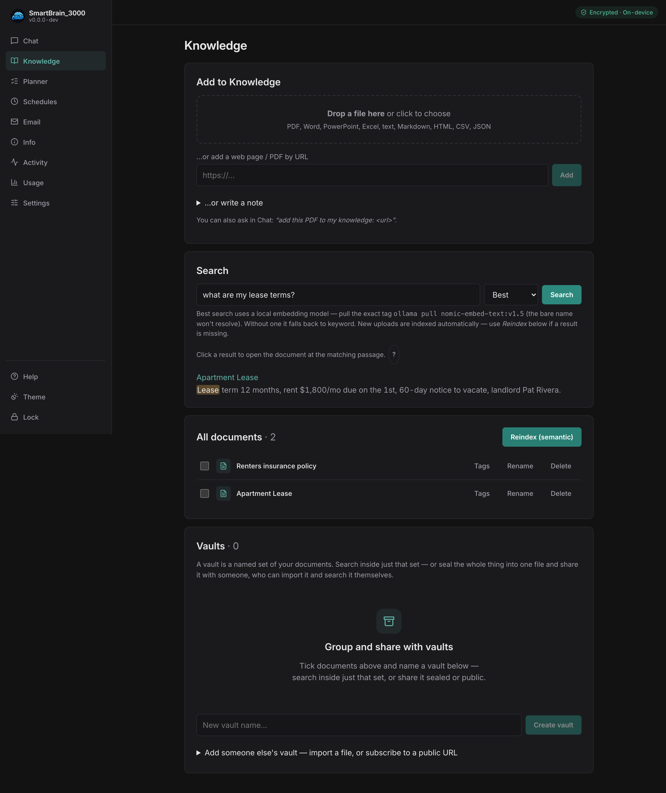
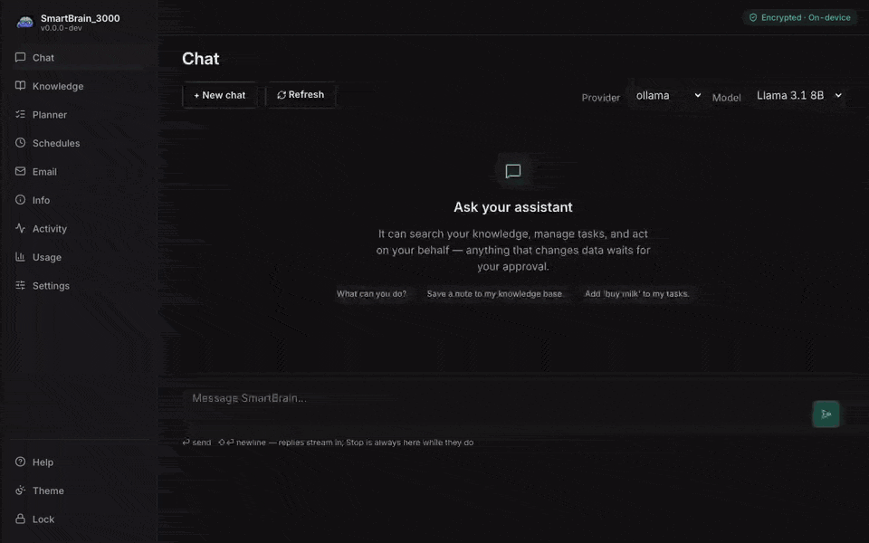
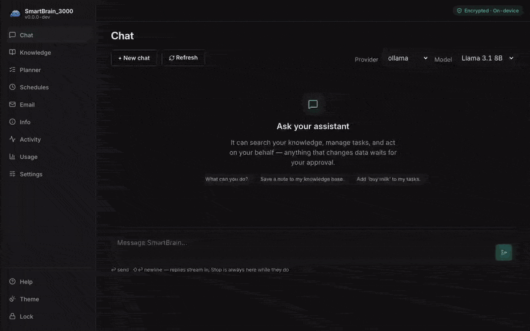
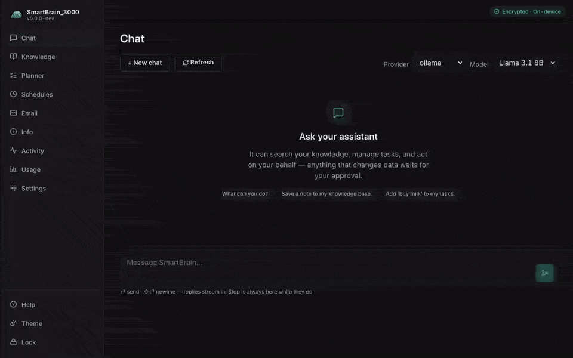
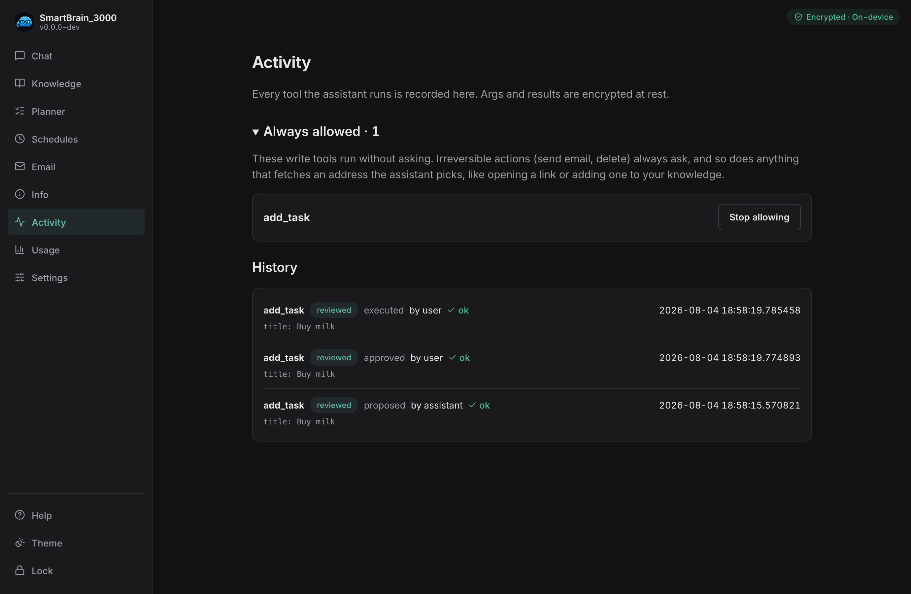

# Using SmartBrain_3000

Everything here runs locally and is encrypted at rest. Here's what each area does.

## Where things live

The sidebar holds nine areas — this is the whole app. On a phone the four you reach for
most sit in the bottom bar (Chat, Knowledge, Info, Activity) and the rest are under **More**:

| Area | What it's for |
| --- | --- |
| **Chat** | Talk to the assistant. It can use tools; anything consequential waits for you. |
| **Knowledge** | Your documents and notes, plus the vaults that group them. |
| **Planner** | Tasks, with due dates, priorities and recurrence. |
| **Schedules** | Prompts that run on a timer. |
| **Email** | An optional Gmail connection: read and send. |
| **Info** | The output of your scheduled runs, newest first. |
| **Activity** | Approvals waiting for you, and the record of everything the assistant tried. |
| **Usage** | What your cloud models have cost. Desktop only. |
| **Settings** | Everything you configure. Desktop only. |

Below them sit four controls: **Help** (this guide, offline, no unlock needed), **Theme**
(follow the system, or force light or dark), **Lock**, and — on a paired phone — **Unpair**.
The top strip shows an **Encrypted · On-device** chip and, on a phone, the remote connection
state. The version you're running is under the logo, top-left.

The **Desktop** shows all nine areas. On a **paired phone**
([Remote access](08-remote-access.md)) you get the seven meant for use on the go — Chat,
Knowledge, Planner, Schedules, Email, Info, and Activity — while Usage, Settings, and
first-time setup stay on the Desktop.

## Chat

Talk to your assistant. Chat can optionally **use tools** to act on your behalf —
search your knowledge, **read or summarize a whole document**, **save a note back to
your knowledge**, add a task, fetch a public web page, send an email, and more — the full
list is under **What the assistant can do**, below. Replies are formatted: headings, lists,
tables, and code blocks render properly.

### While an answer is being written

Answers **stream in** word by word. While one is arriving the Send button becomes
**Stop** — press it and the partial answer is kept, marked *(stopped)*, rather than thrown
away. When the assistant is using tools it narrates what it is doing in place of the
thinking dots: *"Searching the web…"*, *"Reading a document…"*, *"Writing the answer…"*,
each ticked off as it finishes.

If the conversation has scrolled, a **Jump to latest** pill brings you back down.

### After an answer

Every reply carries **Copy** (the raw Markdown, not the rendered page). The most recent one
also offers **Regenerate** — ask again for a fresh answer to your last message. The new
answer is added below the old one rather than replacing it, so what you see is exactly what
a reload will show. Only the newest answer can be regenerated; redoing an older one would
fork the thread.

Answers that used your knowledge show **source chips** underneath — more on those under
**Knowledge**, below.

### Saved chats

**+ New chat** starts a fresh thread. The **Saved chats** picker at the top switches
between them, with **Load older** for threads beyond the first page; **Load older messages**
does the same inside a long thread. **Rename** retitles the open chat (a new chat is titled
from your first message).

**Refresh** reloads the thread and the chat list — useful when you continued a conversation
on your phone and want it on the Desktop, or the reverse. The page also refreshes itself
whenever you come back to it.

**Delete** moves the open chat to the **Trash**; **Delete all…** moves every chat there,
behind a confirmation. Trashed chats are restorable for 30 days from
Settings → Account & Data, and are removed for good after that.

Above the conversation, **Provider** and **Model** pick the model for this session — see
[Choosing a model in Chat](02-models.md#choosing-a-model-in-chat).

### It knows what time it is

The assistant knows what time it is **where you are**. Your browser reports its
timezone and every turn is told your local date and time, with UTC alongside for
cross-zone questions; scheduled runs get the same. There is nothing to configure — the
zone is read from your browser and stored locally, like any other setting.

### Tools and approval

Tools are **risk-tiered**, and this is the core safety idea:

- **Observe** (e.g. knowledge search) runs automatically — it only reads.
- **Reviewed** (e.g. add a task, search the web) is **never run automatically** until you
  say so. The assistant *proposes* it and it waits for your approval in **Activity**. If
  you get tired of approving the same tool, **Always allow** lets that one run without
  asking from then on — and **Stop allowing** takes it back. The two tools that fetch a
  URL the assistant composed (**Fetch a page**, **Add a URL to knowledge**) are allowed
  **per site**: the button reads *Always allow <that site>*, future calls to that exact
  site run unattended, and a different site still asks once. That's deliberate — a page
  the assistant reads could try to talk it into fetching an address an attacker owns,
  and an unknown site always parks for your review.
- **Irreversible** (e.g. send an email, delete a task) always waits for your approval, with
  an extra confirmation, and can never be pre-authorized.

So the assistant can draft and suggest, but anything that changes data or reaches
out requires your explicit OK. Every attempt is recorded in **Activity**.

**For example:** ask *"search my knowledge for the lease terms"* and the assistant
reads and answers immediately (Observe). Ask *"email the landlord about it"* and it
**drafts** the message but **parks it in Activity** — nothing sends until you open
Activity and approve (Irreversible, with an extra confirm).

A parked action doesn't wait indefinitely — see **Activity**, below.

## What the assistant can do

These are the tools it can reach for. It picks them itself; you decide whether they run.

**Observe — runs on its own, reads only:**

| Tool | What it does |
| --- | --- |
| Search knowledge | Finds passages across your documents, or inside one named document. |
| Read a document | Reads a document's text, a window at a time. |
| Summarize a document | Summarizes a document of any length, whole or on a topic you name. |
| List documents | Lists what's in your knowledge base. |
| List tasks | Reads your planner. |
| List schedules | Reads your schedules. |
| Read schedule output | Reads what recent scheduled runs produced. |

**Reviewed — proposed, then waits for your approval. Can be pre-authorized:**

| Tool | What it does |
| --- | --- |
| Save a note | Writes a new document into your knowledge. |
| Remember a fact | Adds a fact to Settings → Memory. |
| Add a task | Adds a planner task. Asking twice for the same thing won't duplicate it. |
| Complete a task | Ticks a task off; a recurring one rolls forward. |
| Update a task | Edits a task's title, date, time, priority, repeat or notes. (Tags are yours to set in Planner; the assistant can't change them.) |
| Search the web | Searches with your configured engine. |
| Fetch a page | Reads one public web page as article text. |
| Research the web | Searches, then reads the top results, in one step. |
| Add a URL to knowledge | Fetches a page or PDF and saves its text. |
| List email | Lists recent inbox messages, without bodies. |
| Read an email | Reads one message. |
| Create a schedule | Adds a recurring prompt. |
| Update a schedule | Edits one. |
| Enable or pause a schedule | Turns one on or off. |

**Irreversible — always asks, every time, with an extra confirmation:**

| Tool | What it does |
| --- | --- |
| Send an email | Sends from the connected Gmail account. |
| Delete a task | Permanently deletes a planner task. |
| Delete a schedule | Permanently deletes a schedule and its run history. |

Two details worth knowing. First, a turn is bounded: the assistant gets **eight tool steps**
and then must write an answer from what it has, saying what it couldn't finish — it can't
loop forever. Second, the three schedule-writing tools **always ask inside a scheduled run**,
even if you pre-authorized them in chat, so a schedule can never quietly grow more schedules.

## Knowledge

A private, encrypted knowledge base. There are three ways in, all on the **Knowledge** page:

- **Drop in files.** Drag them onto the box, or click it to choose. **PDF, Word (.docx),
  PowerPoint (.pptx), Excel (.xlsx), HTML, Markdown, CSV, JSON, and plain text** are
  understood — up to 200 files in one drop, 25 MB each.
- **Paste a URL.** SmartBrain fetches the page, extracts the article text (not the
  navigation and ads around it), and saves that. A URL pointing at a PDF works too. You can
  ask Chat to do the same: *"add this PDF to my knowledge: …"*.
- **Write a note.** A title and some text, typed straight in.

**Big documents are welcome**: a several-hundred-page PDF is fine, and roughly a thousand
dense pages of text are stored and reachable per document. Uploads don't block — they land
right away, keyword search works within seconds, and meaning-search for a very large
document fills in over the next few minutes in the background (it resumes by itself after a
restart). While that is happening the page says so: *"Indexing for meaning search — 4 of 9
done. Keyword search already finds them."*

Adding the same content twice is a no-op — SmartBrain recognises it and keeps the one copy
rather than cluttering your results with duplicates.

**What it can't read.** There is no OCR and no image or audio support. A scanned PDF — one
that is pictures of pages rather than text — has no text to extract, so it is refused with
*"no readable text found in that file"* rather than silently added empty. Word files get no
page numbers either: `.docx` has no fixed pagination, so citations into one name the
document but not a page.

Search your knowledge three ways:

- **Best** (default) — combines both of the below. Keyword search nails an exact name
  or invoice number; meaning search finds a paraphrase. Each misses what the other
  catches, so fusing them beats either alone.
- **Keyword** — ranks by relevance: rare words count for more, and a long document
  can't win just by being long. Needs no model at all.
- **Meaning** — matches by sense rather than wording, using an
  [embedding model](02-models.md).

**Results are citations.** Every hit shows where it came from — *"Lease.pdf · p.12"*
(a slide deck cites *slide 3*, a spreadsheet *sheet 2*) — and clicking it opens the
document **at the passage that matched**, highlighted, rather than at the top. Chat
answers that used your knowledge show the same source chips underneath the reply —
click one to open the document at the cited passage. The chips come from what the
assistant actually searched and read, not from what it *says* it did, so you can
check any claim against the original.

**Organize with tags.** Every document (and vault) has an inline tag editor — click the
tags line on a row to add or change them, and click any tag chip to filter the list to it.
Editing tags is instant and never re-indexes the document. Up to 20 tags per document.

**Each row also has Rename and Delete**, and a checkbox for picking documents to put in a
vault. Renaming re-indexes the document in the background, because the title is part of what
search matches on; tagging doesn't.

**Instant summaries.** In the background SmartBrain builds a summary of every document —
summaries of its parts, reduced into a summary of the whole. That's what makes *"summarize
this"* answer immediately even on a book-length file, and what lets a focused question
("summarize the fees") be answered in seconds instead of a full re-read. The page shows the
progress: *"Preparing instant summaries — 6 of 9 documents ready."* It is built a piece at a
time, resumes after a restart, and steps aside whenever you are chatting.

**Reindex (semantic)** at the top of the document list re-embeds anything that needs it.
Use it after you change the embedding model, or if a document you know is there never turns
up in Meaning search. It works in batches and tells you what's left: *"Indexed 12
document(s) — 30 still to go, continuing in the background."*

**Try it:** open **Knowledge**, drag in a document, and search it. Then ask **Chat**
*"what does my knowledge say about …"* — the assistant searches it for you and tells you
which file and page it got the answer from.

> Semantic search needs an embedding model. If results say *"Showing keyword
> results"*, set one up — see
> [Embeddings](02-models.md#embeddings-for-knowledge-search) — then **Reindex**.

Your knowledge is also what external tools can read over [MCP](05-mcp.md).
Group documents into **vaults** to scope a search — and to share them, privately
or publicly: see [Share knowledge with Vaults](04-vaults.md).

## Planner

Task tracking, deliberately plain. A task is a title plus, if you want them:

- a **due date** and a **time** on that date;
- a **priority** — Low, Medium (the default), or High;
- a **repeat** — none, Daily, or Weekly. Completing a repeating task rolls it forward to
  the next occurrence instead of closing it;
- **tags**, comma-separated, and free-text **notes**.

Tasks group themselves by when they are due: **Today & overdue**, **This week**, **Later**,
**No date**, and **Done**. Anything overdue is called out in red. Each row has a checkbox to
tick it off, **Edit** to change any field, and **Delete**.

The assistant can read your tasks freely, and can add, complete, or edit one with your
approval. Deleting a task is irreversible, so it asks every time.

## Schedules

Run a prompt on a timer — e.g. "every morning, summarize my open tasks." A
schedule fires an assistant turn on its cadence.

The page has two tabs and opens on **Items**. **Create** takes a name, the prompt itself, how often it should
**Repeat** — **Once**, **Hourly**, **Daily**, or **Weekly** — and when it should **First
run**: **Now**, **In 1 hour**, or **Tomorrow**. Three presets (Check the news, Morning
briefing, Weekly knowledge review) fill the form in if you'd rather start from one.

**Items** lists what you have. Each row has a checkbox that enables or pauses it, **Edit**
to change the prompt or cadence, **Run now** to fire it immediately, and a delete button.

Two things to know:

- Schedules only run **while the app is unlocked** (a locked vault can't decrypt
  or act — there's no background access to your data).
- If a scheduled run wants to do something **dangerous** (send, delete, etc.), it
  **parks for your approval** in Activity just like in chat — it won't act alone.

A run's output lands in three places: **in your open Chat** as a "Scheduled Item"
notice, as a durable copy on the **Info** page, and as a badge on the Chat tab while
results are unseen.

## Info

Where scheduled output is kept. The **All** tab lists every run across every schedule,
newest first; there is a tab per schedule for just that one's output, and a **Refresh**
button. Each entry shows when it ran and what it produced — or, if the run wanted approval
for something, *"Awaiting your approval — open Activity to review."*

Nothing here is editable. It's the record: Chat's notice is easy to scroll past, so this is
where you go when you want to find last Tuesday's briefing again. Manage the schedules
themselves on the **Schedules** page.

## Email (Gmail)

Connect a Gmail account with **your own** Google OAuth client. The whole flow is
loopback-only — the authorization happens on your machine and nothing leaves it except
the calls to Google. SmartBrain asks for just two scopes: **read** and **send** (no
archive, delete, or label changes). It's optional; most people run SmartBrain without it.

**One-time setup** (the in-app **Email** page walks you through these):

1. Open [Google Cloud Console → Credentials](https://console.cloud.google.com/apis/credentials),
   then **Create credentials → OAuth client ID**, and choose type **Desktop app**. A Desktop-app
   client needs **no redirect URL** — Google handles loopback automatically.
2. On the **OAuth consent screen**, add the `gmail.readonly` and `gmail.send` scopes and set
   **Publishing status** to **In production** — otherwise Google signs you out every 7 days.
3. In the app's **Email** page, paste the client **ID** and **secret** and click **Connect Gmail**.
   A Google sign-in opens; if it warns the app is "unverified" (it's your own client), choose
   **Advanced → Continue**, then approve the two scopes.

Once connected, the **Email** page shows which address you're connected as, a **Compose**
form (to, subject, message, **Send**), and your recent **Inbox** — click a message to read
it in full. **Disconnect** removes the connection.

- **You** sending from the app is a direct action.
- The **assistant** sending email is an **Irreversible** tool — it always parks
  for your approval first. It can draft; you approve the send. It can also list and read
  your recent mail, both of which wait for approval the first time.

Google sometimes signs SmartBrain out — every 7 days if you left the OAuth consent screen in
testing rather than setting **Publishing status** to *In production*, and occasionally even
if you didn't. The page then says **"Gmail needs reconnecting"** with a one-click
**Reconnect Gmail**; you don't re-enter the client ID or secret. Reconnecting is done on the
Desktop, and a paired phone starts working again by itself afterwards.

## Memory

**Settings → Memory** holds who the assistant is for. Four things live there:

- **Assistant name** — what it calls itself.
- **Your name** — what it calls you.
- **Custom instructions** — standing guidance for every conversation, e.g. *"Be concise.
  Prefer metric units."*
- **Remembered facts** — a list you add to with **Remember** and prune with **Forget**. The
  assistant can propose one too, with your approval.

All of it is encrypted and composed into every conversation, so it's the place to look when
you wonder "why does it keep doing that?" — including any *"(learned) …"* facts
self-improvement added (delete one to permanently reject it).

## Web search

The assistant's web tools search with **DuckDuckGo by default — no key needed**. Under
**Settings → Web search** you can pick which engine to use:

- **Automatic** (the default) — the first engine you have configured, with DuckDuckGo
  last. If one is down, the next takes over.
- **SearXNG** — an instance you host or trust. Paste its URL; its JSON API must be on.
- **Brave Search** or **Tavily** — bring your own key. Both are stored encrypted, like
  cloud-provider keys.
- **DuckDuckGo** — no key, always available as the fallback.

Searches only happen when the assistant actually uses the web tools in a turn; see
[Privacy & security](07-privacy-security.md) for exactly what leaves your machine.

## Self-improvement

SmartBrain can review its own recent performance and carefully improve — **off by
default**, and switched on under **Settings → Self-improvement**. On the cadence you
choose — every 2, 4, 8 (default), or 24 hours — under Settings → Self-improvement (while
unlocked) it scores Chat, Knowledge, and Tools from private, on-device telemetry. Quiet
periods stay silent; when something needs attention you get a short digest in the chat
feed. From a flagged period it may act — always within hard bounds:

- **Learned preferences** — a local model (never a cloud one, and only from messages
  *you* wrote) may learn one durable preference, applied as a visible *"(learned) …"*
  fact in Settings → Memory, measured against your satisfaction, and **auto-reverted if
  it doesn't help**. Deleting the fact yourself permanently rejects it.
- **Suggested routines** — an ask you repeat on a daily/weekly rhythm becomes a
  ready-made schedule **waiting for your approval in Activity**; decline it once and it
  is never offered again.
- **Knowledge gaps** — searches your knowledge couldn't answer get named in the digest.
- **Prompt optimizer** (its own switch) — learns how kinds of requests go and may steer
  them with a short guidance note; a strategy watches in *shadow* first, goes live only
  after a measured trial, is turned off automatically if it doesn't help, and guided
  answers always show a small **"guided · …"** chip.

One change is ever on trial at a time, everything is reversible, every applied or
reverted change is announced, and **Settings → Self-improvement** shows the record of
what it has done under **What it has done**.

## Usage & cost

A running estimate of what your **cloud** models cost. Pick a **Range** — Today (the
default), the last 5, 10 or 30 days, or a custom pair of dates — and you get a row per model
with its calls, prompt and completion tokens, and estimated cost, plus a total. Pricing
comes from each provider's live figures. **Local models (Ollama, MLX) are free** and say
`free` in the cost column.

Usage appears here after you chat with a model. None of it leaves your machine — it's
computed locally from your own token counts, and the only network call is a local fetch of
the price list from the on-device gateway. This page is Desktop-only.

## Activity

Your audit and approvals view. Two parts:

- **Awaiting your approval** — a card per proposed action, naming the tool, what it would
  do, and whether it is reversible. **Approve** or **Deny** it. **Always allow** approves it
  and stops asking for that tool from then on (for the URL tools, for that tool **on that
  site** — the list shows each allowed site as its own row). Denying an action holds for
  the rest of that run: the assistant is told, and an identical retry is refused instead
  of asking you again; anything pre-authorized this way is listed
  under **Always allowed**, where **Stop allowing** takes the permission back. Irreversible
  tools can't be pre-authorized — they ask every time, with an extra confirmation. When the
  action you resolve belongs to a **scheduled** run, the run finishes on the spot and its
  answer lands in the Scheduled updates feed — no need to trigger the schedule again.

  
- **History** — the record of every tool the assistant ran or tried to run: which tool, its
  risk tier, what you decided, whether it succeeded, when, and a summary of what it was
  given. Any error it hit is shown too. Arguments and results are encrypted at rest, and
  secrets are stripped before anything is recorded.

Nothing here can be edited or deleted from inside the app — see
[Design limits](09-design-limits.md) for what that does and doesn't guarantee.

An action left unanswered **expires after an hour**, and **locking cancels everything
pending** — in both cases the action never runs at all. When you deny one instead, the
assistant is told it wasn't approved and carries on from there; it is never told an action
succeeded when it didn't.

## Next

- [Share knowledge with Vaults](04-vaults.md) — sealed shares, public publishing, subscriptions.
- [Connect external tools](05-mcp.md) via MCP.
- [Backup & recovery](06-backup-recovery.md).
- [Design limits](09-design-limits.md) — why some of the boundaries above are where they are.
