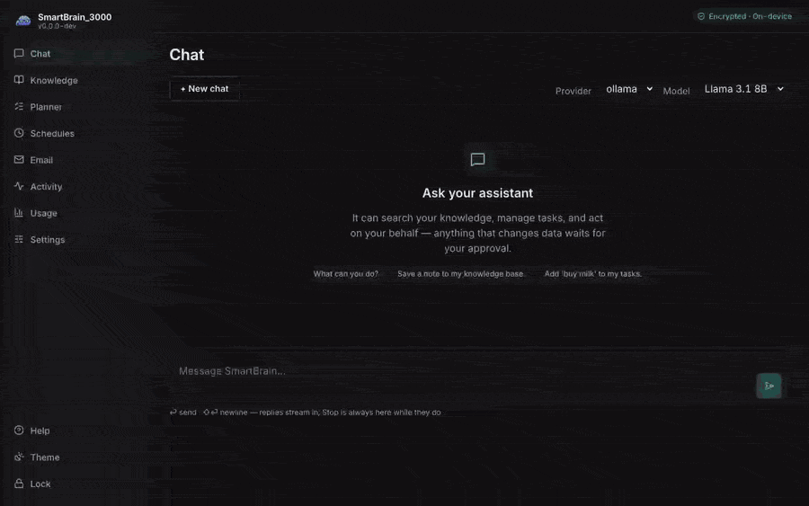

# Share knowledge with Vaults

A **vault** is a named set of your knowledge documents — the unit you scope a search to,
and the unit you share. Vaults live on the Knowledge page.

- **Create one and add documents.** Tick documents in your list, then add them to a new or
  existing vault — or click **Add documents** on the vault itself and it walks you to the list. A document can belong to several vaults; adding it to a vault never moves
  or copies the file, and deleting a vault never deletes its documents — it only removes the
  grouping.
- **See what's inside.** Click the document count on a vault to list its contents — open any of
  them, or remove one from the vault (the document itself is kept).
- **Search inside one.** Pick a vault next to the search box to search *only* its documents
  — e.g. keep a "Work" vault and a "Home" vault and ask each separately.
- **Share it.** **Export** a vault and SmartBrain seals it into a single `.sbvault` file and
  shows you a one-time key (starting `SBVK1-`). Send the file however you like, then give the
  person the key over a **different** channel — together they are the contents in the clear,
  so keep them apart.
- **Share it publicly.** Choose **Public** in the share panel instead: the export is the same
  `.sbvault` file with **no key at all** — anyone with the link can read everything in this
  vault, and there is **no taking it back**. Upload the file anywhere (Drive, S3, any web host)
  and share the link — or unzip it and upload the folder to a static host so future updates only
  re-upload what changed. Once published, the vault card shows a **Public** badge beside your
  publisher fingerprint (`SB-…`) and the published version — the identity and version readers will
  see. The file is still signed, so nobody else can publish an "update" to your vault in your name.
  To publish a **new version**, export it again (replacing the file where you host it): the version
  bumps automatically, and the button reads **Export update (v*N*)** so you know where it lands.
- **Import someone else's.** Pick the `.sbvault` file and paste the key. Its documents are
  **re-encrypted under your own passphrase** as they land (nothing you import can read or
  weaken your data), and anything you already have is kept as-is rather than overwritten. The
  result shows the publisher's fingerprint — the one thing that says *who* the knowledge came
  from. Imported documents are protected from accidental edits (rename/delete are refused);
  **Detach** one in the vault's member list to make that copy yours.
- **Subscribe to a public vault.** For a vault someone published **Public**, paste its URL
  instead of picking a file — no key needed. Link the `.sbvault` file itself, or — if the
  publisher hosts the unzipped folder on a static host — its `manifest.json`. SmartBrain fetches
  it (public internet hosts only, not localhost or LAN addresses), verifies the publisher's
  signature, and re-encrypts the documents under **your** passphrase as they land. The
  publisher's identity is **pinned on first contact** — the vault card shows a **Subscribed**
  badge with the pinned fingerprint and the host it came from — and future updates will only
  ever be accepted from that same publisher.
- **Keep a subscription up to date.** Click **Check for updates** on a subscribed vault; when the
  publisher has published a newer version, **Update now** fetches it, verifies everything against
  the pinned publisher identity, and applies it all-or-nothing — you are never left half-updated.
  Changed documents are updated **in place**, so citations and links to them keep working; new
  ones are added, and ones the publisher removed are deleted. **Anything you edited stays yours**:
  the update reports it as "kept" instead of overwriting it (same for documents you already had —
  your copy wins). On a `manifest.json` (folder) host only the changed files are downloaded; a
  single-file host re-downloads the whole file, and the card notes so. The card also shows how
  long ago it was last checked and flags a failed check ("host may be unreachable"), so a dead or
  stale host is easy to spot. If the
  publisher's **key ever changes**, updates stop with a warning showing both fingerprints — pinned
  (trusted) and offered (new), side by side — until you confirm the new key with the publisher
  out-of-band and choose **Trust new key** (Desktop + passphrase). A newer `.sbvault` *file* of a subscribed vault also applies as an
  update — importing it never creates a duplicate.
- **Scheduled auto-update (opt-in).** Turn on **Auto-update** on a subscribed vault card and pick a
  cadence (daily or weekly) to have SmartBrain check and apply clean updates for you. It is **off by
  default**, runs **only on the Desktop while unlocked**, and **never applies a publisher key change
  on its own** — a changed key still blocks and waits for you to confirm it. Each run reports what it
  did **in the chat feed** ("updated to v3 — 2 documents changed", or a "new publisher key" notice).

**Try it now — the official example vault.** This user guide is itself published as a public
vault. Use **Subscribe to a public vault** and paste
`https://smartbrain.securecloudgroup.com/vaults/smartbrain-docs.sbvault` — on first subscribe
you'll see the publisher fingerprint being pinned; ours is `SB-3WZM-7CEI-GPJ7-3MLC`. If it
matches, you're talking to us. The whole guide lands in your Knowledge, searchable and askable,
and new versions are offered as updates whenever the docs change.

Creating, adding, and searching a vault work everywhere, including a paired phone. **Exporting and
importing a vault are done on the Desktop** — sharing a vault's contents, or bringing new ones in, is
sensitive, so those actions live in the Desktop app.
