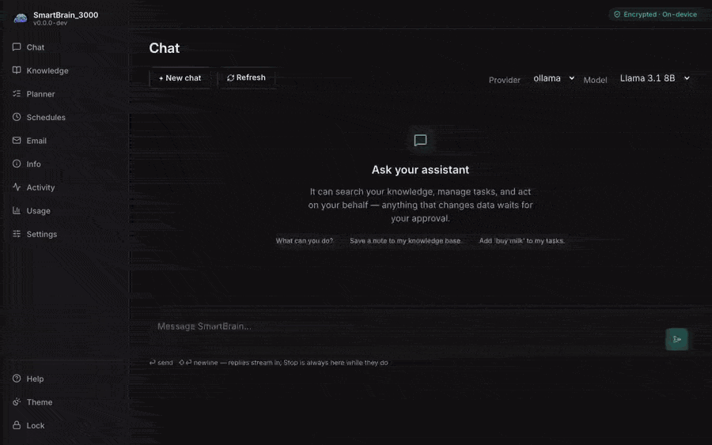
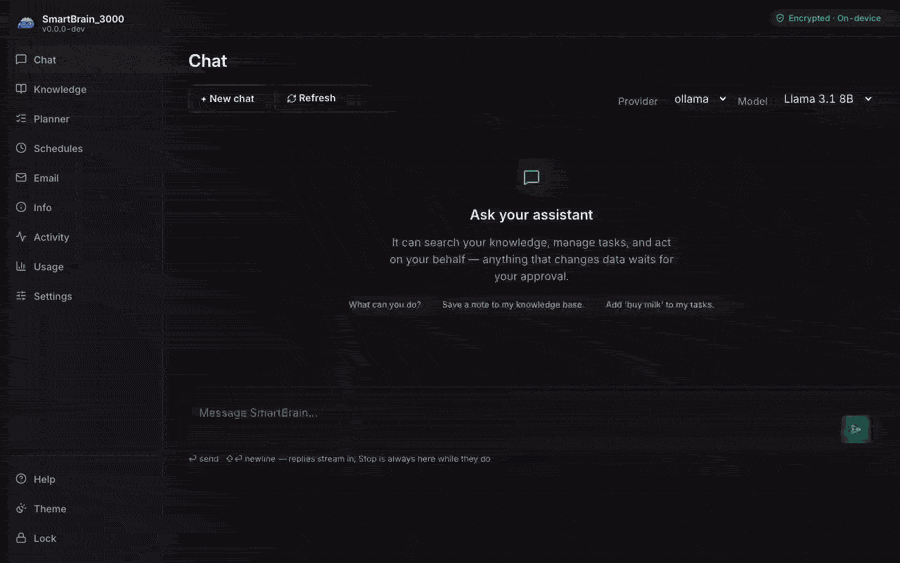

# Share knowledge with Vaults

A **vault** is a named set of your knowledge documents — the unit you scope a search to,
and the unit you share. Vaults live on the Knowledge page.

- **Create one and add documents.** Tick documents in your list, then add them to a new or
  existing vault — or click **Add documents** on the vault itself and it walks you to the list. A document can belong to several vaults; adding it to a vault never moves
  or copies the file, and deleting a vault never deletes its documents — it only removes the
  grouping.
- **See what's inside.** Click the document count on a vault to list its contents — open any of
  them, or remove one from the vault (the document itself is kept).
- **Search inside one.** Pick a vault next to the search box to search *only* its documents
  — e.g. keep a "Work" vault and a "Home" vault and ask each separately.
- **Share it.** Choose **Share…** on the vault and SmartBrain seals it into a single `.sbvault` file and
  shows you a one-time key (starting `SBVK1-`). Send the file however you like, then give the
  person the key over a **different** channel — together they are the contents in the clear,
  so keep them apart. **Every sealed re-share mints a fresh key**: the moment you seal again,
  anyone holding the previous key can no longer open the new file. The share panel warns
  before AND after, and the previous file they already opened is unaffected — the rotation
  only bites the *next* one.
- **Share it publicly.** Choose **Public** in the share panel instead: the export is the same
  `.sbvault` file with **no key at all** — anyone with the link can read everything in this
  vault, and there is **no taking it back**. Upload the file anywhere (Drive, S3, any web host)
  and share the link — or unzip it and upload the folder to a static host so future updates only
  re-upload what changed. Once published, the vault card shows a **Public v*N*** badge beside your
  publisher fingerprint (`SB-…`) — the identity and version readers will see. The file is still
  signed, so nobody else can publish an "update" to your vault in your name.
- **Publish updates.** Export the vault again (choose **Public**) and replace the hosted file
  with the new one — subscribers pick the update up on their next check. The version bumps
  automatically, and the button reads **Export update (v*N*)** so you know where it lands. If
  you export twice with **no content change**, the share panel says so — *"Nothing changed
  since v*N* — you published an identical version."* — before you distribute a file that would
  look like an update but ship no changes. Between publishes, any local edits (renames, added
  documents, sealed re-shares) show on the card as **Unpublished changes** — the muted chip
  that says your working copy has moved past the last public version and a re-export would
  ship the difference.
- **Remember where you put it, and verify the hosted copy.** Below the hosting hint in the
  Share panel, a **Hosted at** row lets you paste the URL you uploaded the `.sbvault` to
  (localhost and LAN addresses are refused — public internet only, `http(s)`, same rule
  subscribers see). It's a note *this install* keeps — it doesn't travel with the vault.
  Once saved, **Verify hosted copy** fetches the file at that URL and checks it against your
  own key and your last publish — the verdicts are plain:
  - *"the hosted file matches what this install last published (v*N*)"* — you're good.
  - *"the hosted file is v*N*, but this install has published up to v*M* — did you forget to
    upload the new file?"* — the classic gap this row catches.
  - *"the hosted file is NEWER (v*N*) than this install's record (v*M*) — was it published
    from another machine?"* — an anomaly worth pausing on.
  - *"the hosted file's signature isn't yours — it is signed by SB-…"* — someone else is
    publishing at that URL; the check never touches your subscription state, so this is safe
    to run.
  - *"upstream returned HTTP 410"* / a timeout / a 404 — reachable=false, the honest network
    fact. A manual verify is a Desktop-only action (like exporting), for the same reason: it
    names your publisher identity in its verdict.
- **Retire the vault.** Choose **Share → Retire…** on a public vault to close the channel:
  SmartBrain produces one final, dated `.sbvault` marked *retired* — upload it in place of
  the current file. Subscribers apply that last version, then move into a **Retired by
  publisher** state that drops out of their auto-checks. **Their documents stay in their
  Knowledge and remain readable** — retirement stops the update channel, it doesn't reach
  back and take your documents. The card on your side flips its Public chip to a muted
  **Retired v*N*** — that's the version subscribers pinned against. If you change your mind
  later, publish again from the same install (same publisher key): the next normal export
  un-retires the vault for every subscriber whose install picks it up.
- **Remove content from every subscriber (the destructive path).** Regular retirement leaves
  everyone's documents intact. If you actually need a document *gone* from subscribers'
  Knowledge — a mistake, a takedown request — remove it from the vault and publish an update
  (or publish an *empty* vault to remove everything). On a subscriber's next update the
  documents you removed are deleted from their Knowledge — **only the imported copies**.
  Anything they authored themselves is never touched, and anything they explicitly claimed
  as theirs with **Detach** is theirs — updates skip it. Use this deliberately: a subscriber
  who's already read a document can't be made to un-read it, and a subscriber who's offline
  won't see the removal until they come back and update.
- **Delete a subscription (the reader's side).** Deleting a subscribed vault card asks what
  to do with its documents: **Keep documents** (the historical default — the grouping goes,
  the documents stay in Knowledge) or **Also remove the vault's imported documents** (the
  imported copies are shredded too). Anything you authored yourself stays either way, and
  anything you'd detached is yours — those always survive.
- **What subscribers see if things go wrong.** The card is honest about state:
  - **Unreachable — the publisher took this vault down.** The host returned HTTP 410 Gone
    (an intentional takedown). Auto-update stops; a manual **Check for updates** will still
    try, and a success clears the flag.
  - **Unreachable — the host hasn't answered for a week.** Eight consecutive failures over
    ≥ 7 days. Same posture: auto-update stops, a manual check still runs, a success clears
    the flag.
  - **Blocked.** The publisher's signing key changed. Updates refuse (never silently
    accept), and the card shows **Pinned (trusted)** and **Offered (new)** fingerprints side
    by side; only a Desktop **Trust new key** with your passphrase moves the pin — the app
    never re-pins on a timer.
- **Every publish is dated.** Each open export stamps a UTC calendar date the manifest
  carries; on a subscriber's card the date appears as **published *YYYY-MM-DD***. It's a
  small thing that answers a large question: "when was this actually written?"
- **Import someone else's.** Pick the `.sbvault` file and paste the key. Its documents are
  **re-encrypted under your own passphrase** as they land (nothing you import can read or
  weaken your data), and anything you already have is kept as-is rather than overwritten. The
  result shows the publisher's fingerprint — the one thing that says *who* the knowledge came
  from. Imported documents are protected from accidental edits (rename/delete are refused);
  **Detach** one in the vault's member list to make that copy yours.
- **Subscribe to a public vault.** For a vault someone published **Public**, paste its URL
  instead of picking a file — no key needed. Link the `.sbvault` file itself, or — if the
  publisher hosts the unzipped folder on a static host — its `manifest.json`. SmartBrain fetches
  it (public internet hosts only, not localhost or LAN addresses), verifies the publisher's
  signature, and re-encrypts the documents under **your** passphrase as they land. The
  publisher's identity is **pinned on first contact** — the vault card shows a **Subscribed**
  badge with the pinned fingerprint and the host it came from — and future updates will only
  ever be accepted from that same publisher.
- **Keep a subscription up to date.** Click **Check for updates** on a subscribed vault; when the
  publisher has published a newer version, **Update now** fetches it, verifies everything against
  the pinned publisher identity, and applies it all-or-nothing — you are never left half-updated.
  Changed documents are updated **in place**, so citations and links to them keep working; new
  ones are added, and ones the publisher removed are deleted. **Anything you edited stays yours**:
  the update reports it as "kept" instead of overwriting it (same for documents you already had —
  your copy wins). On a `manifest.json` (folder) host only the changed files are downloaded; a
  single-file host re-downloads the whole file, and the card notes so. The card also shows how
  long ago it was last checked and flags a failed check ("host may be unreachable"), so a dead or
  stale host is easy to spot. If the
  publisher's **key ever changes**, updates stop with a warning showing both fingerprints — pinned
  (trusted) and offered (new), side by side — until you confirm the new key with the publisher
  out-of-band and choose **Trust new key** (Desktop + passphrase). A newer `.sbvault` *file* of a subscribed vault also applies as an
  update — importing it never creates a duplicate.
- **Scheduled auto-update (opt-in).** Turn on **Auto-update** on a subscribed vault card and pick a
  cadence (daily or weekly) to have SmartBrain check and apply clean updates for you. It is **off by
  default**, runs **only on the Desktop while unlocked**, and **never applies a publisher key change
  on its own** — a changed key still blocks and waits for you to confirm it. Each run reports what it
  did **in the chat feed** ("updated to v3 — 2 documents changed", or a "new publisher key" notice).

**Try it now — the official example vault.** This user guide is itself published as a public
vault. Use **Subscribe to a public vault** and paste
`https://smartbrain.securecloudgroup.com/vaults/smartbrain-docs.sbvault` — on first subscribe
you'll see the publisher fingerprint being pinned; ours is `SB-3WZM-7CEI-GPJ7-3MLC`. If it
matches, you're talking to us. The whole guide lands in your Knowledge, searchable and askable,
and new versions are offered as updates whenever the docs change — the card shows the date the
version you're reading was published, so you can see at a glance how current it is.

**What travels.** A vault export carries the documents themselves — their titles and text —
and nothing else. Your **tags do not travel**: they're your labels, not the publisher's, and
they stay behind. For the same reason you can't tag the copies an imported vault gave you; a
future update would overwrite them. **Detach** a copy first if you want to make it yours and
label it.

**Reading the card.** A vault card carries chips for whatever applies:

- **Private** — a local vault you haven't shared. The default and the positive indicator, not
  the absence of one.
- **Shared · sealed** — you've sealed-shared this at least once; the receiver needs the key.
- **Public v*N*** — the version you last published open. Beside it: your publisher
  fingerprint (`SB-…`) — the identity subscribers pin.
- **Unpublished changes** — your working copy has moved past **Public v*N***. Re-export to
  ship the difference.
- **Retired v*N*** — you retired this vault at that version. Muted, because it's a done
  state; publish again to un-retire.
- **Imported** — the vault arrived as a `.sbvault` file (not a URL subscription); the pinned
  fingerprint is beside it either way.
- **Subscribed** — a live URL subscription. Beside it: the pinned fingerprint, the version
  you have, the host it came from, and — from the publisher's own manifest — **published
  *YYYY-MM-DD***.
- **Blocked** — the publisher's key changed; updates refuse until you trust it out-of-band.
- **Retired by publisher** — the publisher retired this vault. Documents stay in your
  Knowledge, checking stops.
- **Unreachable** — the host stopped responding (taken down or dead for a week); auto-update
  stops, a manual check still runs.

Checking a subscription tells you where you stand — *"Up to date (v3)."* or *"Update
available (v3 → v4)."*

Creating a vault, adding documents to it, and searching inside it work everywhere, including
a paired phone. **Exporting, importing, subscribing, and trusting a publisher's changed key
are done on the Desktop** — sharing a vault's contents, bringing new ones in, and deciding
whom to trust are all sensitive, so those actions live in the Desktop app.

## Next

- [Using SmartBrain_3000](03-features.md) — the Knowledge page these vaults live on.
- [Connect external tools](05-mcp.md) — imported vault content is labeled with its
  provenance there too.
- [Privacy & security](07-privacy-security.md) — what a subscription fetches, and when.
