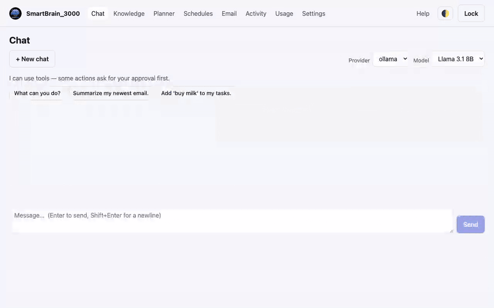

# Backup & recovery

Everything lives in one encrypted database on your machine. These tools, under
**Settings → Account & Data**, let you take it with you, restore it, and change
your passphrase — plus how to get back in if you forget it.

## Export your data

**Export data (JSON)** downloads your content — knowledge, chats, tasks,
memories, profile — as readable JSON. It's decrypted (it's yours), so keep the
file somewhere safe. Good for reading your data elsewhere or migrating out.
Because it hands out decrypted data, it runs on the **Desktop only** (never from a
paired phone) and **re-prompts for your passphrase** to authorize.

## Encrypted backup

**Download encrypted backup** gives you a complete, portable copy of the database
(a `.duckdb` file). It's still encrypted — it includes your wrapped keys — so it
restores with the **same passphrase**. This is the one to keep for disaster
recovery and to move your install to a new machine. Like Export, it's
**Desktop-only** and **re-prompts for your passphrase** before it hands over the vault.

## Restore

**Stage restore** takes a backup file, validates it, and applies it the **next
time SmartBrain_3000 restarts** (swapping the live database while it's running
isn't safe). Your current database is kept alongside as `*.pre-restore-<timestamp>`,
so a restore is reversible.

- Allowed when you're **unlocked**, or onto a **fresh install** (moving to a new
  machine) — never over a locked, initialized vault.
- After staging, restart the stack (`python3 installer/install.py update`, or
  restart the container) and unlock with that backup's passphrase.
- A backup from a **newer version** of SmartBrain_3000 is **refused on purpose**
  (it would risk data loss under older code): upgrade this app first, then restore.

## Change your passphrase

**Change passphrase** re-wraps your master key under a new passphrase after
verifying the current one. Your data and your Recovery Key stay valid — only the
passphrase changes.

## Forgot your passphrase?

There is **no server and no reset**. Use your **Recovery Key** from the Emergency
Kit you saved during setup:

1. Lock / reopen the app and choose **Unlock with Recovery Key**.
2. Enter the key exactly as shown (dashes and letter case don't matter).
3. Once in, go to **Settings → Account & Data → Change passphrase** and use
   **"Forgot your current passphrase… Set a new one"** — that path sets a new
   passphrase from your unlocked session, so you don't need the old one. (The
   normal Change passphrase form still requires the current one.)

If you lose **both** the passphrase and the Recovery Key, the data cannot be
recovered — that's the cost of having no backdoor. Keep the Emergency Kit safe.

## Next

- [Privacy & security](07-privacy-security.md) — what's protected and what leaves your machine.
