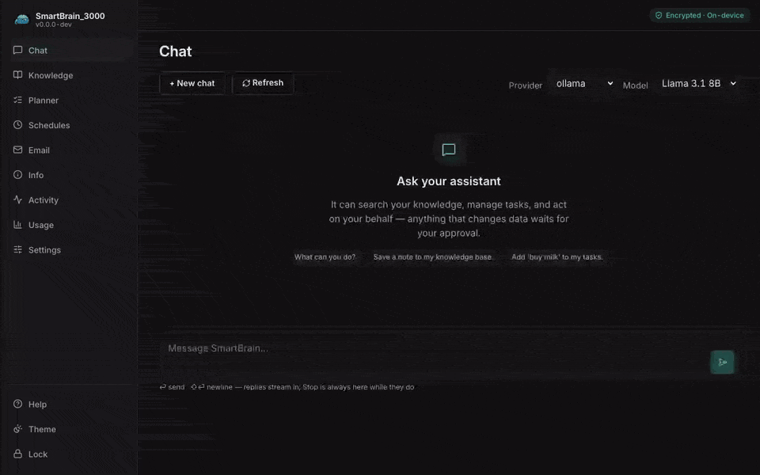

# Backup & recovery



Everything lives in one encrypted database on your machine. These tools, under
**Settings → Account & Data**, let you take it with you, restore it, and change
your passphrase — plus how to get back in if you forget it.

## Export your data

**Export data (JSON)** downloads your content as readable JSON: your profile, remembered
facts, tasks, knowledge documents (title and text), and every conversation with its
messages. It's decrypted (it's yours), so keep the file somewhere safe. Good for reading
your data elsewhere or migrating out.

It is **not** a backup — it holds no keys and cannot be restored from. Use the encrypted
backup below for that.

Because it hands out decrypted data, it runs on the **Desktop only** (never from a
paired phone) and **re-prompts for your passphrase** to authorize. It saves as
`smartbrain-export.json`.

## Encrypted backup

**Download encrypted backup** gives you a complete, portable copy of the database
(`smartbrain-backup.duckdb`). It's still encrypted — it includes your wrapped keys — so it
restores with the **same passphrase**. This is the one to keep for disaster
recovery and to move your install to a new machine. Like Export, it's
**Desktop-only** and **re-prompts for your passphrase** before it hands over the vault.

Both buttons ask for the **passphrase**, so if you got in with your Recovery Key, set a new
passphrase first (**Change passphrase → "Forgot your current passphrase… Set a new one"**)
and then take the backup.

## Restore

**Stage restore** takes a backup file, validates it, and applies it the **next
time SmartBrain_3000 restarts** (swapping the live database while it's running
isn't safe). Your current database is kept alongside as `*.pre-restore-<timestamp>`,
so a restore is reversible.

- Allowed when you're **unlocked**, or onto a **fresh install** (moving to a new
  machine) — never over a locked, initialized vault.
- After staging, restart SmartBrain — **Restart** in the menu-bar / tray menu, or
  `docker compose -f docker-compose.release.yml restart` on Linux (from source,
  `python3 installer/install.py update`) — and unlock with that backup's passphrase.
- A backup from a **newer version** of SmartBrain_3000 is **refused on purpose**
  (it would risk data loss under older code): upgrade this app first, then restore.
- A file that isn't a SmartBrain backup, is empty, or is larger than 1 GiB is refused
  before anything is touched.

### Moving to a new machine

The whole move is four steps:

1. On the old machine, **Download encrypted backup**.
2. Install SmartBrain on the new machine and let it finish its first start. Don't complete
   setup — a restore onto a **fresh install** is exactly the supported case.
3. **Stage restore** with the backup file.
4. Restart SmartBrain and unlock with the **old machine's** passphrase.

Your Recovery Key comes across with the backup and still works.

## When something is broken: what to try, in order

Three escalating repairs. Start at the top; each is slower and more disruptive than the one
above it, and most problems never get past the first.

1. **Restart.** Choose **Restart** in the menu-bar / tray menu. Then reload the browser tab.
   This fixes most transient trouble and takes seconds.
2. **A clean upgrade.** Non-destructive, a couple of minutes: stop SmartBrain, clear any
   leftovers, upgrade the launcher, start it again. This is the right answer for a
   half-finished install or a stuck port. See
   [Getting started → If an install is misbehaving](01-getting-started.md#if-an-install-is-misbehaving-a-clean-upgrade).
3. **A full reset**, below — the last resort.

## Starting completely fresh

If an install is broken in a way that neither a restart nor a clean upgrade can fix, there
is a full reset: back up, remove everything SmartBrain put on the machine, install the
latest version, and restore your data.

**This is the last resort, and you almost certainly do not need it.** Work through the two
steps above first — a **Restart** from the menu, then the
[clean upgrade](01-getting-started.md#if-an-install-is-misbehaving-a-clean-upgrade), then a
hard reload of the browser tab. A full reset re-downloads the whole app and takes 10–30
minutes.

```sh
bash installer/full-reset.sh --inventory   # what is on this machine; changes nothing
bash installer/full-reset.sh --dry-run     # the whole plan, carried out on nothing
bash installer/full-reset.sh               # do it
```

It will not continue without a backup file it has checked, it shows every deletion before
it happens and asks you to type a confirmation word, and it never deletes your backup or
your data — your data folder is **moved** to `~/SmartBrain-reset-<timestamp>/`, not removed.

One step is manual, and skipping it is the usual reason a correct reinstall still looks
broken: **clear the browser**. SmartBrain installs a service worker that caches the app,
and it will keep serving the old version after a reinstall. The script prints a snippet to
paste into your browser console that unregisters it and clears the cached app, the
paired-device credential, and stored settings. A paired phone has to be paired again
afterwards.

macOS only for now. On Windows the same five steps apply, against `%APPDATA%\SmartBrain`
and the Scoop package.

## Chat Trash

Deleted chats (one at a time, or Chat's **Delete all…**) land here for **30 days**. Each
one shows when it was deleted and how long it has left, with **Restore** to bring it back.
**Delete all chats** here does the same as Chat's own button, and **Empty trash** purges
everything in the trash immediately. After 30 days they're removed for good automatically.

## Change your passphrase

**Change passphrase** re-wraps your master key under a new passphrase after
verifying the current one. Your data and your Recovery Key stay valid — only the
passphrase changes. A passphrase must be at least 8 characters.

## Forgot your passphrase?

There is **no server and no reset**. Use your **Recovery Key** from the Emergency
Kit you saved during setup:

1. Lock / reopen the app and choose **Use recovery key**.
2. Enter the key exactly as shown (dashes and letter case don't matter).
3. Once in, go to **Settings → Account & Data → Change passphrase** and use
   **"Forgot your current passphrase… Set a new one"** — that path sets a new
   passphrase from your unlocked session, so you don't need the old one. (The
   normal Change passphrase form still requires the current one.)

If you lose **both** the passphrase and the Recovery Key, the data cannot be
recovered — that's the cost of having no backdoor. Keep the Emergency Kit safe.

## Next

- [Privacy & security](07-privacy-security.md) — what's protected and what leaves your machine.
