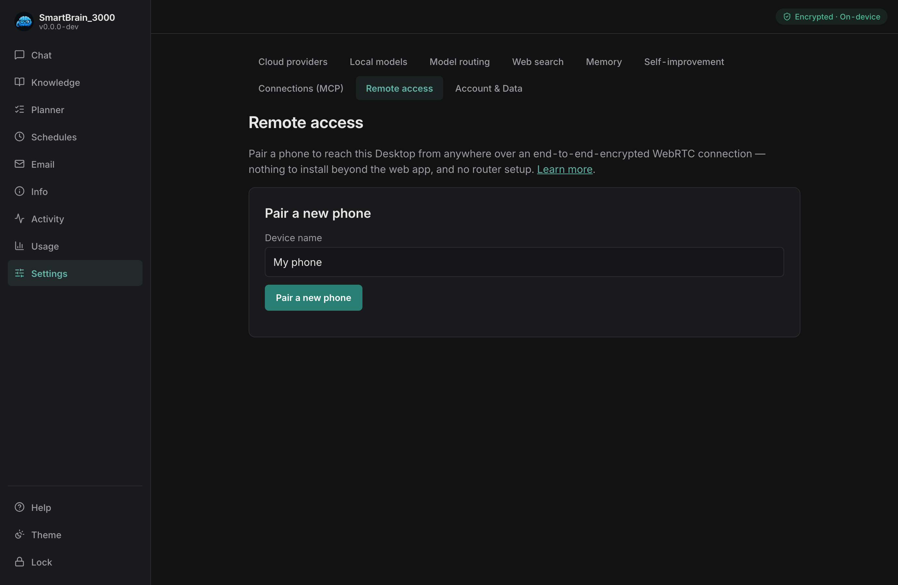
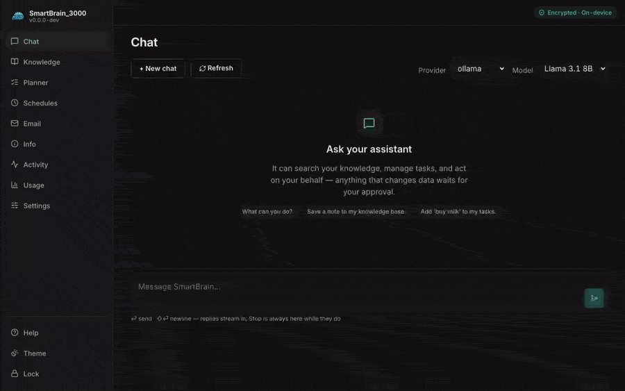

# Remote access (away from home)

By default SmartBrain_3000 runs only on your own computer. **Remote access** lets you
reach it from your phone — on Wi-Fi or cellular — without any router or port-forward
setup. It's **off by default**; you opt in by pairing a phone.

## How it works

Your **Desktop** is where you set everything up. To use SmartBrain on your phone, you
**pair** the phone once. After that, the phone reaches your Desktop over **WebRTC** — a
direct, **end-to-end-encrypted** connection (DTLS). When a direct link isn't possible,
traffic falls back to an encrypted **relay** that still can't read your data.

This uses a small **signaling node** on a public server (not your home machine) that helps your
phone find your Desktop. SmartBrain is **preconfigured to use one**, so there's nothing to set
up — your Desktop dials **out** to it, so nothing on your home network is ever exposed. The node
is **content-blind**: it only relays the encrypted connection setup, never your data. (Prefer your
own node? See *Self-hosting the signaling node* at the end.)

## Pair your phone





On the **Desktop**, open **Settings → Remote access**, give the phone a name (it defaults to
*My phone*, and is only a label so you can tell your devices apart later), and tap
**Pair a new phone**. You'll see a QR code, three short steps, and a **6-character code**.

On the **phone**:

1. **Scan the QR** (or open the address shown) to load SmartBrain in your browser.
2. **Add it to your Home Screen**, then open the installed app:
   - **iPhone/iPad:** the **Share** button → *Add to Home Screen*.
   - **Android:** the **⋮** menu → *Install app*.
3. In the installed app, **enter the 6-character code** and tap **Pair**.

The Desktop watches while you do this and says so: *"Waiting for your phone…"*, then
*"Your phone connected."*

That's it — the phone connects, from Wi-Fi or cellular. The code lasts **5 minutes** and the
page counts it down; if it expires, tap **Pair a new phone** for a fresh one. One pairing
can be in progress at a time.

If your Desktop is **locked** while the phone pairs or connects, the Desktop says so to the
phone: *"your Desktop is locked — unlock it there, then this phone reconnects."* The phone
keeps retrying and walks in on its own once you unlock; the pairing screen's timeout names
the locked case too, so you know what to do.

> Why install first? On iPhone, an app on the Home Screen has its own private storage, separate
> from Safari — so pairing happens *in the installed app*. The QR's only job is to open the site
> so you can install it; it carries no secret.

## Using it on your phone

The phone shows a **trimmed set** of areas meant for use on the go: **Chat**,
**Knowledge**, **Planner**, **Schedules**, **Email**, **Info**, **Activity**, and **Usage**.
Settings and first-time setup live on the **Desktop**. Adding to your Knowledge — notes,
uploads, and add-by-URL, plus importing or subscribing to someone else's vault — works from
the phone too; the desktop is still where it lands.

A handful of individual actions are Desktop-only, even inside those areas — anything that
hands out your data or changes trust. Exporting a vault (sharing it sealed or public),
trusting a publisher's new key after it rotates, connecting Gmail, and downloading a backup
or export all stay on the Desktop. On the phone those controls are either not shown or
replaced with a line pointing you at the Desktop, so nothing fails halfway.

Voice works on the phone too — the mic, spoken replies, and the pills above the message box.
The settings behind those pills (the wake word, playback speed, and the **Short / Medium /
Long** reply default) are set on the Desktop under **Settings → Status → Voice**, since
Settings is Desktop-only. See [Voice](03-features.md#voice).

A small **"Remote"** chip shows the connection state: **direct** (phone-to-Desktop),
**relayed** (through the encrypted relay), **Desktop locked** if your Desktop is up and
the encrypted bridge is fine but its vault is locked — tap the chip to unlock from here
(it's one shared lock: unlocking from the phone unlocks the Desktop too, and a Desktop
sitting on its unlock screen walks in on its own),
**unreachable** if your Desktop is off, asleep, or otherwise can't be reached at all, or
**BLOCKED** in red if your Desktop's identity can't be verified — re-pair if you reinstalled
the app.

The connection is built to survive a phone: it sends a small keepalive so an idle mobile
network can't quietly drop it, notices a dead path within about a minute and reconnects on
its own, and tolerates you switching apps for a few minutes. If the retries do give up, the
next tap in the app starts it again.

Your Desktop must be **running** for any of this to work, and **unlocked** to do anything
with — a locked Desktop tells your phone so, and the phone reconnects by itself after the
unlock. Since the phone is a window onto the Desktop, they share one vault and one lock:
unlock (or lock) on either, and both follow. The phone is a window onto it, not a copy of
it.

## Manage devices

Under **Settings → Remote access** you can pair more devices, see when each was paired, and
**Revoke** any of them at any time. A revoked device can no longer connect. On the phone
itself, **Unpair** in the sidebar forgets the pairing from that end.

## Security

- **Off by default.** Nothing is reachable until you pair a device.
- **End-to-end encrypted.** The connection is encrypted (DTLS); the signaling node and
  relay only ever see scrambled bytes, never your data.
- **Identity-checked.** Before sending anything, your phone verifies your Desktop's
  identity (a key pinned at pairing), so a compromised node can't impersonate it.
- **One-time code.** The 6-character pairing code is single-use and short-lived — don't share
  it. (The QR only opens the site; it carries no secret.)

This changes *where you can reach the app from*, not what protects your data. See
[Privacy &amp; security](07-privacy-security.md).

## On your own Wi-Fi (LAN, HTTPS)

If you only want your phone to reach the Desktop **on the same Wi-Fi**, you don't need
the signaling node at all — you can serve the app over HTTPS on your local network. This
uses a local certificate so your phone trusts the connection.

> This path is set up by the repo's installer, so it needs an
> [install from source](01-getting-started.md#install-from-source-for-contributors). Pairing
> above works on every install and needs none of this.

1. **Make a local certificate** (uses [mkcert](https://github.com/FiloSottile/mkcert)),
   passing a name and your Desktop's LAN IP:

   ```sh
   python3 installer/install.py certs smartbrain.local 192.168.1.50
   ```

   It writes the cert to `data/certs/`, trusts the local CA on your computer, and prints
   the path to **`rootCA.pem`**.
2. **Trust the CA on your phone** — install that `rootCA.pem` (AirDrop/email it to
   yourself, then open it) so the phone trusts the local certificate.
3. **Allow your LAN address and bring it up over HTTPS.** Set
   `SMARTBRAIN_ALLOWED_HOSTS` to include your LAN IP/name in `compose/.env`, e.g.
   `SMARTBRAIN_ALLOWED_HOSTS=localhost,127.0.0.1,192.168.1.50,smartbrain.local`, then
   re-run `python3 installer/install.py install`. Once a cert exists the installer
   automatically serves HTTPS on your LAN.
4. **On the phone (same Wi-Fi)** open `https://192.168.1.50:33000`.

> **Connecting Gmail over HTTPS.** Google's loopback OAuth redirect is `http://`, which the
> HTTPS app can't serve directly. In HTTPS mode the app therefore also runs a tiny
> **loopback-only** helper (on `127.0.0.1:33001`; set `SMARTBRAIN_OAUTH_HELPER_PORT` to change
> it — it must differ from the app port) that forwards the OAuth callback to HTTPS. Connecting
> Gmail then works exactly as on plain HTTP, and the helper is **never** exposed to the LAN.

This path is **same-network only**. To reach the Desktop from cellular or another
network, use the WebRTC pairing above.

## Self-hosting the signaling node (advanced)

SmartBrain ships pointed at a hosted, content-blind node, so **most people need none of this.**
To run your own node instead:

1. **Run the node** on a small public server with a domain (open ports 80/443 TCP, 3478
   TCP+UDP, 49160-49260 UDP):

   ```sh
   SIGNALING_DOMAIN=<your-domain>  ACME_EMAIL=<you@example.com>  SIGNALING_OPEN=1 \
   TURN_SECRET=$(openssl rand -hex 32)  TURN_PUBLIC_IP=<vps-ipv4> \
     docker compose -f compose/docker-compose.signaling.yml up -d
   ```

   The node mints **ephemeral TURN credentials** per connection (coturn `use-auth-secret`),
   so no secret is ever baked into the app or a QR.
2. **Point your Desktop at it** — set in your environment / `.env`:

   ```sh
   SMARTBRAIN_SIGNALING_URL=wss://<your-domain>
   ```

   The Desktop fetches STUN/TURN from the node automatically; there's nothing else to set.
   Then pair devices as above.

(A WireGuard VPN overlay also exists as a CLI-only alternative —
`python3 installer/install.py wireguard up` — but WebRTC is the recommended path.)

## Next

- [Privacy &amp; security](07-privacy-security.md) — what's protected and the real world limits.
